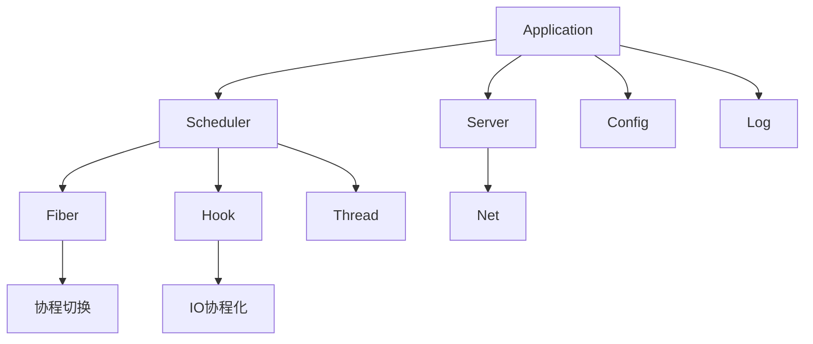

# LoNetfw - 高性能 C++ 网络框架

本框架基于 [sylar](https://github.com/sylar-yin/sylar) 网络框架学习重写，支持 Linux 和 Windows 平台。

## 平台支持

| 平台 | IO 多路复用 | Hook 实现 | 线程库 |
|------|------------|----------|--------|
| Linux | epoll | dlsym | pthread |
| Windows | wepoll | MinHook | pthreads-w32 |

---

## 模块架构

```
LoNetfw
    │
    ├─ fiber/          # 协程模块（用户态轻量级线程）
    │
    ├─ scheduler/      # 调度器模块（协程调度、IO调度）
    │
    ├─ hook/           # Hook 模块（阻塞函数协程化）
    │
    ├─ thread/         # 线程与同步模块（Mutex、Semaphore、Thread）
    │
    ├─ log/            # 日志系统（多级别、高性能）
    │
    ├─ config/         # 配置系统（YAML、类型安全）
    │
    ├─ net/            # 网络基础模块（Address、Socket、Uri）
    │
    ├─ server/         # 服务器基础模块（TcpServer）
    │
    ├─ system/         # 系统管理模块（Application、Env、Daemon）
    │
    └─ tests/          # 测试示例
```



---

## 核心模块说明

### 1. Fiber - 协程模块

用户态轻量级线程，实现高性能并发。

**核心概念**：
- **INIT**：初始化状态
- **READY**：可执行状态（等待调度）
- **EXEC**：执行中状态
- **HOLD**：挂起状态（等待外部事件）
- **TERM**：结束状态
- **ERROR**：错误状态

**详见**：[fiber/README.md](./fiber/README.md)

### 2. Scheduler - 调度器模块

管理协程的调度和执行。

**核心组件**：
- **Scheduler**：基础调度器
- **IOScheduler**：IO 调度器（epoll/wepoll）

**详见**：[scheduler/README.md](./scheduler/README.md)

### 3. Hook - 钩子模块

将阻塞函数转换为协程化异步操作。

**Hook 的函数**：
- sleep/usleep/nanosleep
- connect/accept
- send/recv/read/write

**详见**：[hook/README.md](./hook/README.md)

### 4. Thread - 线程与同步模块

提供线程和同步原语。

**核心组件**：
- **Thread**：线程封装
- **Mutex/RWMutex/SpinLock**：互斥锁
- **Semaphore**：信号量
- **ScopedLock**：RAII 锁管理

**详见**：[thread/README.md](./thread/README.md)

### 5. Log - 日志系统

高性能、多级别的日志系统。

**核心组件**：
- **Logger**：日志记录器
- **LogAppender**：日志输出器
- **LogFormatter**：格式化器
- **LogEvent**：日志事件
- **LogLevel**：日志级别

**详见**：[log/README.md](./log/README.md)

### 6. Config - 配置系统

类型安全的配置管理。

**特性**：
- YAML 配置文件解析
- 类型安全的配置访问
- 配置变更回调

**详见**：[config/README.md](./config/README.md)

### 7. Net - 网络基础模块

网络通信基础设施。

**核心组件**：
- **Address**：地址抽象（IPv4/IPv6）
- **Socket**：套接字封装
- **SocketStream**：流式接口
- **Uri**：URL 解析

**详见**：[net/README.md](./net/README.md)

### 8. Server - 服务器基础模块

TCP 服务器基类。

**核心组件**：
- **TcpServer**：TCP 服务器基类
- **ServerFactory**：服务器工厂

**详见**：[server/README.md](./server/README.md)

### 9. System - 系统管理模块

程序运行基础设施。

**核心组件**：
- **Application**：应用程序框架
- **Env**：环境管理
- **Daemon**：守护进程

**详见**：[system/README.md](./system/README.md)

---

## 快速开始

### 编译

#### Linux（Ubuntu 18.04+）

```bash
bash build.sh
```

#### Windows（Visual Studio 2022）

```powershell
git submodule sync --recursive
git submodule update --init --recursive
mkdir build
cd build
cmake ..
# 生成 .sln 后使用 VS 打开编译
```

### 基础使用示例

```cpp
#include "lonetfw/lonetfw.h"

static auto g_logger = LON_LOG_ROOT;

void http_client() {
    // 解析地址
    lon::net::Address::Ptr addr;
    lon::net::Address::parse(addr, "www.example.com:80", AF_INET);
    
    // 创建 Socket
    auto socket = lon::net::Socket::create(addr);
    
    // 连接（自动协程化）
    auto ret = socket->connect(addr);
    if (!ret) {
        LON_ERROR(g_logger) << "connect failed";
        return;
    }
    
    // 发送 HTTP 请求
    auto request = std::make_shared<lon::http::HttpRequest>();
    request->setPath("/");
    request->setHeader("Host", "www.example.com");
    
    auto connection = std::make_shared<lon::httpservice::HttpConnection>(socket, true);
    connection->sendRequest(request);
    
    // 接收响应
    auto response = connection->recvResponse();
    LON_INFO(g_logger) << response->toString();
}

int main(int argc, char const *argv[]) {
    // 加载配置
    lon::config::Config::parseFromYaml(".config/log.yaml");
    
    // 创建 IO 调度器
    auto ios = std::make_shared<lon::scheduler::IOScheduler>(2, true, "io");
    
    // 添加任务
    ios->schedule(http_client);
    
    return 0;
}
```

---

## 模块依赖关系

```
┌─────────────────────────────────────────────────┐
│              Application（应用层）               │
└─────────────────────────────────────────────────┘
                       ↓
┌─────────────────────────────────────────────────┐
│           HttpService / WebSocket（服务层）      │
└─────────────────────────────────────────────────┘
                       ↓
┌─────────────────────────────────────────────────┐
│           Server / Net（网络层）                 │
└─────────────────────────────────────────────────┘
                       ↓
┌─────────────────────────────────────────────────┐
│      Scheduler + Hook + Fiber（调度层）          │
└─────────────────────────────────────────────────┘
                       ↓
┌─────────────────────────────────────────────────┐
│      Thread + Log + Config（基础层）             │
└─────────────────────────────────────────────────┘
```

---

## 各模块 README

| 模块 | 说明 | 文档 |
|------|------|------|
| fiber | 协程模块 | [README.md](./fiber/README.md) |
| scheduler | 调度器模块 | [README.md](./scheduler/README.md) |
| hook | Hook 模块 | [README.md](./hook/README.md) |
| thread | 线程与同步模块 | [README.md](./thread/README.md) |
| log | 日志系统 | [README.md](./log/README.md) |
| config | 配置系统 | [README.md](./config/README.md) |
| net | 网络基础模块 | [README.md](./net/README.md) |
| server | 服务器基础模块 | [README.md](./server/README.md) |
| system | 系统管理模块 | [README.md](./system/README.md) |

---

## 测试示例

测试示例位于 `tests/` 目录：

- `tests/main.cpp` - 日志系统测试示例
- 上层框架测试示例位于 `d:\git\LoNHttpfw\tests/` 目录

---

## 致谢

本框架基于 [sylar](https://github.com/sylar-yin/sylar) 网络框架学习重写，感谢原作者的开源贡献。

---

## License

MIT License