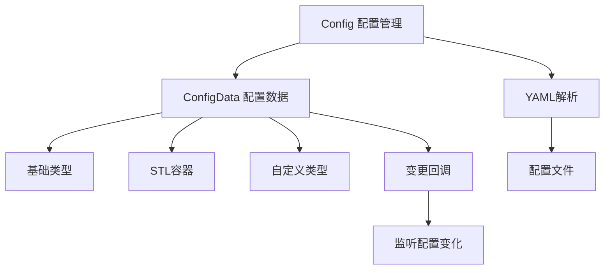

# LoNetfw 配置系统架构设计

## 架构概览

```
Config 配置系统
    │
    ├─ Config（配置管理核心）
    │    ├─ 配置项注册
    │    ├─ 配置项访问
    │    └─ YAML 解析
    │
    ├─ ConfigData（配置数据模板）
    │    ├─ 类型安全
    │    ├─ 变更回调
    │    └─ 序列化支持
    │
    └─ GlobalConfig（全局配置）
         └─ 框架内部配置管理
```



---

## 1. 什么是配置系统？（通俗理解）

### 1.1 用生活例子理解配置

想象一个智能家电：

| 场景 | 传统方式 | 配置系统 |
|------|---------|---------|
| 设置温度 | 固定 25°C | 从配置读取，可调整 |
| 设置亮度 | 固定 100% | 从配置读取，可调整 |
| 定时开关 | 固定时间 | 从配置读取，可调整 |

**配置系统就是让程序"可定制化"的机制。**

### 1.2 配置系统的作用

| 功能 | 说明 |
|------|------|
| **集中管理** | 所有配置项统一管理 |
| **类型安全** | 编译期检查类型 |
| **动态更新** | 支持运行时修改 |
| **变更通知** | 配置变化时回调通知 |

---

## 2. 核心组件详解

### 2.1 Config（配置管理核心）

**Config 提供配置项的注册和访问接口：**

```cpp
class Config {
public:
    // 设置配置项
    template<typename T>
    static typename ConfigData<T>::Ptr setData(
        const std::string& name,
        const T& value,
        const std::string& description = ""
    );
    
    // 获取配置项
    template<typename T>
    static typename ConfigData<T>::Ptr getData(const std::string& name);
    
    // 从 YAML 文件加载
    static void parseFromYaml(const std::string& file);
    
    // 遍历所有配置项
    static void visit(std::function<void(ConfigVarBase::Ptr)> cb);
};
```

### 2.2 ConfigData（配置数据模板）

**ConfigData 封装单个配置项：**

```cpp
template<typename T>
class ConfigData {
public:
    // 获取配置值
    const T& getData() const;
    
    // 设置配置值
    void setData(const T& value);
    
    // 添加变更回调
    void addConfigDataChangeCB(std::function<void(const T&, const T&)> cb);
    
    // 获取名称和描述
    const std::string& getName() const;
    const std::string& getDescription() const;
    
    // 序列化
    std::string toString() const;
    bool fromString(const std::string& str);
};
```

### 2.3 GlobalConfig（全局配置）

**GlobalConfig 管理框架内部配置：**

```cpp
// 访问全局配置
auto fiber_config = lon::config::GlobalConfig::Instance().config_fiber;
auto log_config = lon::config::GlobalConfig::Instance().config_log;

// 使用配置
size_t stack_size = fiber_config->getData().stack_size;
LogLevel::Level level = log_config->getData().level;
```

---

## 3. 支持的数据类型

### 3.1 基础类型

```cpp
// 整数
Config::setData("server.port", 8080, "服务端口");
int port = Config::getData<int>("server.port")->getData();

// 浮点数
Config::setData("threshold", 0.5f, "阈值");
float threshold = Config::getData<float>("threshold")->getData();

// 字符串
Config::setData("server.host", "127.0.0.1", "服务地址");
std::string host = Config::getData<std::string>("server.host")->getData();

// 布尔值
Config::setData("debug", true, "调试模式");
bool debug = Config::getData<bool>("debug")->getData();
```

### 3.2 STL 容器

```cpp
// vector
Config::setData("ports", std::vector<int>{8080, 8081, 8082}, "端口列表");
auto ports = Config::getData<std::vector<int>>("ports")->getData();

// list
Config::setData("names", std::list<std::string>{"Alice", "Bob"}, "名字列表");
auto names = Config::getData<std::list<std::string>>("names")->getData();

// set
Config::setData("ids", std::set<int>{1, 2, 3}, "ID集合");
auto ids = Config::getData<std::set<int>>("ids")->getData();

// map
std::map<std::string, int> scores = {{"Alice", 100}, {"Bob", 90}};
Config::setData("scores", scores, "分数表");
auto scores_map = Config::getData<std::map<std::string, int>>("scores")->getData();
```

### 3.3 自定义类型

```cpp
// 定义结构体
struct Person {
    std::string name;
    int age;
    
    bool operator==(const Person& other) const {
        return name == other.name && age == other.age;
    }
};

// 特化 LexicalCast（字符串 <-> Person）
namespace lon {
namespace util {

template<>
class LexicalCast<std::string, Person> {
public:
    Person operator()(const std::string& str) {
        YAML::Node node = YAML::Load(str);
        Person person;
        person.name = node["name"].as<std::string>();
        person.age = node["age"].as<int>();
        return person;
    }
};

template<>
class LexicalCast<Person, std::string> {
public:
    std::string operator()(const Person& person) {
        YAML::Node node;
        node["name"] = person.name;
        node["age"] = person.age;
        std::stringstream ss;
        ss << node;
        return ss.str();
    }
};

}
}

// 使用自定义类型
Config::setData("admin", Person{"Alice", 25}, "管理员信息");
auto admin = Config::getData<Person>("admin")->getData();
```

---

## 4. YAML 配置文件

### 4.1 配置文件格式

```yaml
# config.yaml

# 服务配置
server:
  port: 8080
  host: "127.0.0.1"
  timeout: 30000

# 数据库配置
database:
  url: "mysql://localhost:3306/mydb"
  user: "root"
  password: "123456"

# 日志配置
log:
  level: "INFO"
  path: "/var/log/myapp.log"

# 端口列表
ports:
  - 8080
  - 8081
  - 8082

# 线程池配置
thread_pool:
  size: 4
  queue_size: 100
```

### 4.2 加载配置文件

```cpp
#include "config/config.h"

int main() {
    // 从 YAML 文件加载配置
    lon::config::Config::parseFromYaml("config.yaml");
    
    // 访问配置
    int port = lon::config::Config::getData<int>("server.port")->getData();
    std::string host = lon::config::Config::getData<std::string>("server.host")->getData();
    
    std::cout << "服务地址: " << host << ":" << port << std::endl;
    
    return 0;
}
```

---

## 5. 配置变更监听

### 5.1 添加变更回调

```cpp
#include "config/config.h"

void config_change_example() {
    // 创建配置项
    auto threshold_config = lon::config::Config::setData("threshold", 0.5f, "敏感度阈值");
    
    // 添加变更回调
    threshold_config->addConfigDataChangeCB([](float old_val, float new_val) {
        std::cout << "阈值变更: " << old_val << " -> " << new_val << std::endl;
    });
    
    // 修改配置（会触发回调）
    threshold_config->setData(0.8f);  // 输出：阈值变更: 0.5 -> 0.8
    
    // 再次修改
    threshold_config->setData(0.3f);  // 输出：阈值变更: 0.8 -> 0.3
}
```

### 5.2 实际应用示例

```cpp
#include "config/config.h"
#include "log/logger.h"

static auto g_logger = LON_LOG_ROOT;

void setup_config() {
    // 日志级别配置
    auto log_level = lon::config::Config::setData<std::string>("log.level", "INFO", "日志级别");
    log_level->addConfigDataChangeCB([](const std::string& old_level, const std::string& new_level) {
        // 更新日志级别
        LON_INFO(g_logger) << "日志级别变更: " << old_level << " -> " << new_level;
        
        // 实际更新日志器
        auto logger = LON_LOG_MANAGER.getLogger("root");
        if (logger) {
            logger->setLevel(lon::log::LogLevel::fromString(new_level));
        }
    });
    
    // 服务端口配置
    auto port = lon::config::Config::setData<int>("server.port", 8080, "服务端口");
    port->addConfigDataChangeCB([](int old_port, int new_port) {
        LON_INFO(g_logger) << "端口变更: " << old_port << " -> " << new_port;
        // 可以在这里重新绑定端口等操作
    });
}

int main() {
    lon::config::Config::parseFromYaml("config.yaml");
    setup_config();
    
    // 运行时修改配置（触发回调）
    lon::config::Config::getData<int>("server.port")->setData(9090);
    
    return 0;
}
```

---

## 6. 完整使用示例

### 6.1 基础使用

```cpp
#include "config/config.h"
#include "log/logger.h"

static auto g_logger = LON_LOG_ROOT;

void basic_config_example() {
    // 设置配置项
    lon::config::Config::setData("server.port", 8080, "服务端口");
    lon::config::Config::setData("server.host", std::string("127.0.0.1"), "服务地址");
    lon::config::Config::setData("debug", true, "调试模式");
    lon::config::Config::setData("timeout", 30000, "超时时间(ms)");
    
    // 获取配置项
    int port = lon::config::Config::getData<int>("server.port")->getData();
    std::string host = lon::config::Config::getData<std::string>("server.host")->getData();
    bool debug = lon::config::Config::getData<bool>("debug")->getData();
    int64_t timeout = lon::config::Config::getData<int64_t>("timeout")->getData();
    
    LON_INFO(g_logger) << "服务地址: " << host << ":" << port;
    LON_INFO(g_logger) << "调试模式: " << debug;
    LON_INFO(g_logger) << "超时时间: " << timeout << "ms";
}
```

### 6.2 从 YAML 加载

```cpp
#include "config/config.h"
#include "log/logger.h"

static auto g_logger = LON_LOG_ROOT;

void yaml_config_example() {
    // 加载 YAML 配置
    lon::config::Config::parseFromYaml(".config/log.yaml");
    
    // 访问配置（假设 YAML 中有）
    auto level = lon::config::Config::getData<std::string>("log.level");
    if (level) {
        LON_INFO(g_logger) << "日志级别: " << level->getData();
    }
    
    auto formatter = lon::config::Config::getData<std::string>("log.formatter");
    if (formatter) {
        LON_INFO(g_logger) << "日志格式: " << formatter->getData();
    }
}
```

### 6.3 结合 tests/main.cpp 的实际使用

```cpp
// 参考 tests/main.cpp
#include "log/logger.h"
#include "util/util.h"

using namespace lon;
using namespace log;
using namespace util;

int main(int argc, char const *argv[])
{
    // 创建日志器
    auto l = std::make_shared<Logger>("test", LogLevel::Level::DEBUG);
    
    // 添加控制台输出器
    l->addAppender(std::make_shared<StdoutLogAppender>(LogLevel::Level::WARN));
    
    // 添加文件输出器（从配置读取路径）
    auto file_appender = std::make_shared<FileLogAppender>("./.log/test.log");
    file_appender->setFormatter(std::make_shared<LogFormatter>(
        "%d{%Y-%m-%d %H:%M:%S}%T%t%T%N%T%F%T[%p]%T[%c]%T%f:%l%T%m%n"));
    l->addAppender(file_appender);
    
    // 创建日志事件
    auto e = std::make_shared<LogEvent>(LogLevel::DEBUG, std::string(__FILE__), __LINE__, 0,
                                        util::getThreadId(), util::getFiberId(),
                                        util::getCurrentDateTime(), "thread");
    e->getMessageStream() << "hello lon log";
    l->log(LogLevel::Level::DEBUG, e);
    
    // 使用宏记录日志
    LON_DEBUG(l) << "hello lon debug" << 122 << 3.1415926;
    LON_INFO(l) << "hello lon info";
    LON_WARN(l) << "hello lon warn";
    LON_ERROR(l) << "hello lon error";
    LON_FATAL(l) << "hello lon fatal";
    
    // 格式化日志
    LON_DEBUG_FMT(l, "hello lon debug %s:%d", "123123", 12);
    
    // 使用日志管理器
    LON_LOG_MANAGER.setLogger("test", l);
    auto lm = LON_LOG_MANAGER.getLogger("root");
    if (lm != nullptr)
    {
        LON_DEBUG(lm) << "hello lm lon info";
    }
    
    // 类型转换测试
    auto res = util::lexical_cast<double>("3.1415");
    std::cout << res << "\n";
    
    return 0;
}
```

---

## 7. 常见问题解答

### Q1: 配置项的命名有什么规范？

**建议使用点号分隔的层级命名：**

```cpp
// 推荐
"server.port"      // 服务器端口
"server.host"      // 服务器地址
"database.url"     // 数据库 URL
"log.level"        // 日志级别

// 不推荐
"serverPort"       // 不够清晰
"SERVER_PORT"      // 不符合规范
```

### Q2: 配置项不存在会怎样？

**getData 返回空指针：**

```cpp
auto config = lon::config::Config::getData<int>("not.exist");
if (!config) {
    // 配置项不存在
    std::cout << "配置项不存在" << std::endl;
}
```

### Q3: 如何遍历所有配置项？

**使用 visit 方法：**

```cpp
lon::config::Config::visit([](lon::config::ConfigVarBase::Ptr config) {
    std::cout << config->getName() << ": " << config->toString() << std::endl;
});
```

### Q4: 配置文件路径如何管理？

**建议使用 Env 管理配置路径：**

```cpp
#include "system/env.h"

int main(int argc, char** argv) {
    ENVMGR.init(argc, argv);
    
    // 获取配置路径
    std::string config_path = ENVMGR.getConfigPath();
    lon::config::Config::parseFromYaml(config_path + "/app.yaml");
}
```

---

## 8. 总结

### 配置系统的本质

**配置系统 = 程序的"可定制化"机制**

- 集中管理所有配置
- 类型安全的访问
- 支持动态更新
- 提供变更通知

### 配置系统的核心机制

| 机制 | 作用 |
|------|------|
| Config | 配置管理核心 |
| ConfigData | 配置数据封装 |
| LexicalCast | 类型转换 |
| YAML 解析 | 配置文件加载 |

### 配置系统的优势

1. **集中管理**：所有配置统一管理
2. **类型安全**：编译期检查类型
3. **灵活扩展**：支持自定义类型
4. **动态更新**：支持运行时修改
5. **变更通知**：配置变化时回调

### 与其他模块的关系

```
Config（配置系统）
    ↓
被所有模块使用
    ├─ Log（日志配置）
    ├─ Scheduler（调度器配置）
    ├─ Server（服务器配置）
    └─ System（系统配置）
```