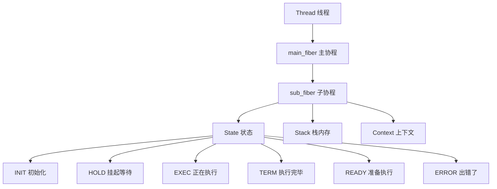

# LoNetfw 协程系统架构设计

## 架构概览

```
Thread（线程）
  └─ main_fiber（主协程 - 线程的"主人")
       │
       ├─ sub_fiber_1（子协程1 - 可以随时切换出去）
       ├─ sub_fiber_2（子协程2 - 可以随时切换出去）
       ├─ sub_fiber_3（子协程3 - 可以随时切换出去）
       └─ ...（可以有成千上万个子协程）
```



---

## 1. 什么是协程？（通俗理解）

### 1.1 用生活例子理解协程

想象你在做饭：

| 场景 | 传统方式（线程） | 协程方式 |
|------|-----------------|---------|
| 切菜 | 必须切完才能做下一件事 | 切一半可以暂停，去炒菜 |
| 炒菜 | 必须炒完才能做下一件事 | 炒一会可以暂停，去切菜 |
| 等水烧开 | 必须傻等，不能做其他事 | 可以去切菜，水开了再回来 |

**协程就像一个可以随时"暂停"和"恢复"的任务**，不像线程那样必须从头执行到尾。

### 1.2 协程 vs 线程（核心区别）

| 对比项 | 线程 | 协程 |
|--------|------|------|
| **谁控制切换** | 操作系统（你无法控制） | 程序自己（你完全控制） |
| **切换开销** | 很大（要进入内核） | 很小（只在用户态） |
| **内存占用** | 每个线程 8MB+ 栈空间 | 每个协程可配置（默认 1MB） |
| **能开多少个** | 几千个就撑不住了 | **几百万个都没问题** |
| **编程难度** | 异步回调很复杂 | 同步代码很简洁 |

**比喻**：
- **线程** = 公司员工（操作系统管理，切换要走流程）
- **协程** = 个人待办事项（自己管理，随时切换）

---

## 2. 协程的核心概念（详细解释）

### 2.1 主协程和子协程

**每个线程都有一个"主协程"，它是线程的入口点。**

```
┌─────────────────────────────────────────────────┐
│                   Thread（线程）                  │
│                                                 │
│    ┌─────────────────────────────────────┐     │
│    │        main_fiber（主协程）           │     │
│    │                                     │     │
│    │   线程启动时自动创建                   │     │
│    │   它是线程的"主人"                    │     │
│    │   所有子协程都在它上面运行             │     │
│    └─────────────────────────────────────┘     │
│                      │                          │
│                      │ swapIn() 切换到子协程     │
│                      ↓                          │
│    ┌─────────────────────────────────────┐     │
│    │        sub_fiber（子协程）            │     │
│    │                                     │     │
│    │   执行用户任务                        │     │
│    │   可以随时 yield（让出）              │     │
│    │   执行完毕回到主协程                   │     │
│    └─────────────────────────────────────┘     │
│                      │                          │
│                      │ swapOut() 切回主协程     │
│                      ↓                          │
│              回到 main_fiber                    │
└─────────────────────────────────────────────────┘
```

**关键理解**：
- 主协程 = 线程的"调度中心"
- 子协程 = 实际执行任务的"工人"
- 子协程执行完毕或让出时，控制权**必须**回到主协程

### 2.2 协程的切换过程（详细流程）

```
步骤1: 创建主协程
─────────────────
Thread 启动
    ↓
调用 Fiber::getThis()
    ↓
自动创建 main_fiber（主协程）
    ↓
主协程开始执行


步骤2: 创建子协程
─────────────────
main_fiber 运行中
    ↓
new Fiber(callback)  // 创建子协程
    ↓
子协程状态 = INIT（初始化）
    ↓
分配栈内存（独立的执行空间）


步骤3: 切换到子协程
─────────────────
调用 sub_fiber->swapIn()
    ↓
保存主协程的执行位置（寄存器、栈指针）
    ↓
恢复子协程的执行位置
    ↓
子协程开始执行
    ↓
子协程状态 = EXEC（执行中）


步骤4: 子协程让出
─────────────────
子协程调用 yieldToReady() 或 yieldToHold()
    ↓
保存子协程的执行位置
    ↓
恢复主协程的执行位置
    ↓
回到主协程
    ↓
子协程状态 = READY 或 HOLD


步骤5: 再次切换
─────────────────
再次调用 sub_fiber->swapIn()
    ↓
从上次暂停的位置继续执行
    ↓
（就像看书翻页，暂停后回来继续读）


步骤6: 子协程结束
─────────────────
子协程执行完毕
    ↓
自动切换回主协程
    ↓
子协程状态 = TERM（终止）
    ↓
可以 reset() 复用栈空间
```

### 2.3 协程状态详解

协程有 6 种状态，理解它们对使用协程非常重要：

| 状态 | 含义 | 什么时候出现 | 下一步 |
|------|------|-------------|--------|
| **INIT** | 初始化 | 刚创建协程时 | 调用 swapIn() → EXEC |
| **EXEC** | 执行中 | 正在运行 | 执行完毕 → TERM，或 yield → HOLD/READY |
| **HOLD** | 挂起 | 等待某个条件（如 IO） | 条件满足 → swapIn() → EXEC |
| **READY** | 就绪 | 让出后准备再次执行 | 调度器自动 → swapIn() → EXEC |
| **TERM** | 终止 | 执行完毕 | 可以 reset() 复用 → INIT |
| **ERROR** | 错误 | 执行时抛出异常 | 不可恢复 |

**状态流转图（完整版）**：

```
                    创建协程
                        │
                        ↓
                    ┌───────┐
                    │ INIT  │ ←──── reset() 复用
                    └───────┘           │
                        │               │
                        │ swapIn()      │
                        ↓               │
                    ┌───────┐           │
         yield ──→ │ EXEC  │ ←───────┘ │
         │         └───────┘             │
         │             │                 │
         │             │                 │
    ┌────┴────┐       │ 执行完毕         │
    │         │       ↓                 │
┌───────┐ ┌───────┐ ┌───────┐           │
│ READY │ │ HOLD  │ │ TERM  │ ──────────┘
└───────┘ └───────┘ └───────┘
    │         │
    │         │ 条件满足
    │         ↓
    │     swapIn()
    │         │
    └────┴────→ 回到 EXEC
                │
                │ 异常
                ↓
            ┌───────┐
            │ ERROR │
            └───────┘
```

**HOLD vs READY 的区别**：

| 状态 | 含义 | 谁来唤醒 |
|------|------|---------|
| HOLD | 等待外部条件（如 IO 就绪） | 外部事件触发后唤醒 |
| READY | 只是暂时让出，随时可以执行 | 调度器自动调度 |

**比喻**：
- HOLD = 等快递（快递到了才能继续）
- READY = 去喝杯水（随时回来继续工作）

### 2.4 协程上下文（Context）

**上下文是什么？**

上下文就是协程的"执行快照"，保存了：
- **CPU 寄存器**：当前计算到哪一步了
- **栈指针**：函数调用链在哪里
- **执行位置**：代码运行到哪一行

**比喻**：上下文就像游戏的"存档"，保存了：
- 你在哪里（执行位置）
- 你有什么装备（寄存器状态）
- 你的任务进度（栈状态）

**切换协程 = 加载存档**：
```
保存当前存档（主协程上下文）
    ↓
加载另一个存档（子协程上下文）
    ↓
从那个存档的位置继续游戏
```

---

## 3. 协程的栈内存（详细解释）

### 3.1 什么是栈？

栈是函数执行时的"工作台"，存储：
- **局部变量**：函数里的临时数据
- **函数参数**：传入函数的数据
- **返回地址**：函数执行完回到哪里

### 3.2 协程的独立栈

**每个协程都有自己独立的栈空间**：

```
┌─────────────────────────────────────────────────┐
│                   Thread                         │
│                                                 │
│  ┌─────────────┐  ┌─────────────┐  ┌─────────┐ │
│  │ main_fiber  │  │ sub_fiber_1 │  │sub_fiber│ │
│  │             │  │             │  │   _2    │ │
│  │ 栈空间      │  │ 栈空间      │  │ 栈空间  │ │
│  │ (系统分配)   │  │ (1MB)       │  │ (1MB)   │ │
│  └─────────────┘  └─────────────┘  └─────────┘ │
│                                                 │
│  每个协程的栈是独立的，互不干扰                    │
└─────────────────────────────────────────────────┘
```

**为什么需要独立栈？**

如果共享栈，协程切换时会破坏数据：

```
❌ 共享栈的问题：

协程A在栈上：局部变量 x = 100
    ↓
切换到协程B
    ↓
协程B在栈上：局部变量 x = 200（覆盖了A的数据！）
    ↓
切回协程A
    ↓
协程A的 x 变成了 200（数据被破坏！）

✅ 独立栈的好处：

协程A的栈：x = 100（安全保存）
协程B的栈：x = 200（独立空间）
切换时各自的数据不受影响
```

### 3.3 栈大小选择

| 栈大小 | 适用场景 | 内存占用 |
|--------|---------|---------|
| 64KB | 简单任务，无深层调用 | 64KB × 协程数 |
| 1MB（默认） | 一般任务，适中调用深度 | 1MB × 协程数 |
| 8MB | 复杂任务，深层递归 | 8MB × 协程数 |

**计算示例**：

```
100万协程，栈大小 1MB：
内存占用 = 100万 × 1MB = 1TB（太多了！）

100万协程，栈大小 64KB：
内存占用 = 100万 × 64KB = 64GB（还可以）

所以：协程数量多时，栈大小要小！
```

---

## 4. 跨平台实现（详细解释）

### 4.1 Windows 实现

Windows 使用系统提供的 Fiber API：

```cpp
// Windows 协程实现
void* m_fiber;  // 系统分配的 Fiber 句柄

// 创建协程
m_fiber = CreateFiber(stack_size, FiberProc, this);

// 切换协程
SwitchToFiber(m_fiber);  // 切入
SwitchToFiber(main_fiber);  // 切出

// 删除协程
DeleteFiber(m_fiber);
```

**Windows 的优势**：
- 系统自动管理栈内存
- API 简单易用
- 性能稳定

### 4.2 Linux 实现

Linux 使用 ucontext（用户态上下文）：

```cpp
// Linux 协程实现
ucontext_t m_ctx;  // 上下文结构
void* m_stack;     // 手动分配的栈

// 创建协程
m_stack = malloc(stack_size);  // 手动分配栈
getcontext(&m_ctx);            // 获取当前上下文
m_ctx.uc_stack.ss_sp = m_stack;
m_ctx.uc_stack.ss_size = stack_size;
makecontext(&m_ctx, FiberMainFunc, 0);  // 设置入口函数

// 切换协程
swapcontext(&main_ctx, &m_ctx);  // 切入并保存当前
swapcontext(&m_ctx, &main_ctx);  // 切出并保存当前
```

**Linux 的优势**：
- 完全用户态，无需系统调用
- 更灵活的控制
- 更小的开销

---

## 5. 核心代码详解

### 5.1 创建协程

```cpp
Fiber::Fiber(std::function<void()> cb, size_t stack_size)
    : m_id(++s_fiber_id),      // 分配唯一ID
      m_cb(cb),                // 保存执行函数
      m_stack_size(stack_size),// 栈大小
      m_state(INIT)            // 初始状态
{
    // Windows: 使用系统 API 创建
    #ifdef _WIN32
    m_fiber = CreateFiber(stack_size, FiberProc, this);
    #else
    // Linux: 手动分配栈和设置上下文
    m_stack = StackAllocator::allocate(stack_size);
    getcontext(&m_ctx);
    m_ctx.uc_stack.ss_sp = m_stack;
    m_ctx.uc_stack.ss_size = stack_size;
    makecontext(&m_ctx, &Fiber::mainFunc, 0);
    #endif
    
    ++s_fiber_count;  // 协程计数
}
```

### 5.2 切换协程

```cpp
void Fiber::swapIn() {
    setThis(this);     // 设置当前协程为 this
    m_state = EXEC;    // 状态改为执行中
    
    #ifdef _WIN32
    SwitchToFiber(m_fiber);  // Windows: 直接切换
    #else
    swapcontext(&(t_main_fiber->m_ctx), &m_ctx);  // Linux: 交换上下文
    #endif
}

void Fiber::swapOut() {
    setThis(t_main_fiber.get());  // 设置当前协程为主协程
    
    #ifdef _WIN32
    SwitchToFiber(t_main_fiber->m_fiber);  // 切回主协程
    #else
    swapcontext(&m_ctx, &(t_main_fiber->m_ctx));
    #endif
}
```

### 5.3 协程主函数

```cpp
void Fiber::mainFunc() {
    Fiber::Ptr cur = getThis();  // 获取当前协程
    
    try {
        cur->m_cb();       // 执行用户函数
        cur->m_state = TERM;  // 执行完毕，状态 TERM
    } catch (...) {
        cur->m_state = ERROR; // 异常，状态 ERROR
    }
    
    // 执行完毕，切回主协程
    cur->swapOut();
}
```

### 5.4 让出执行权

```cpp
// 让出，状态设为 READY（准备再次执行）
void Fiber::yieldToReady() {
    Fiber::Ptr cur = getThis();
    cur->m_state = READY;
    cur->swapOut();  // 切回主协程
}

// 让出，状态设为 HOLD（等待条件）
void Fiber::yieldToHold() {
    Fiber::Ptr cur = getThis();
    cur->m_state = HOLD;
    cur->swapOut();  // 切回主协程
}
```

---

## 6. 使用示例（详细注释）

### 6.1 最简单的协程示例

```cpp
#include "fiber/fiber.h"

void simple_example() {
    // 步骤1: 必须先获取主协程（初始化线程的协程系统）
    auto main_fiber = lon::fiber::Fiber::getThis();
    std::cout << "主协程已创建" << std::endl;
    
    // 步骤2: 创建子协程
    lon::fiber::Fiber::Ptr sub_fiber(new lon::fiber::Fiber([]() {
        std::cout << "子协程开始执行" << std::endl;
        
        // 步骤3: 子协程让出执行权
        lon::fiber::Fiber::yieldToHold();
        
        std::cout << "子协程继续执行" << std::endl;
    }));
    
    // 步骤4: 主协程切换到子协程
    std::cout << "主协程切换到子协程" << std::endl;
    sub_fiber->swapIn();  // 子协程执行到 yield，切回这里
    
    std::cout << "回到主协程" << std::endl;
    
    // 步骤5: 再次切换到子协程（从上次暂停的位置继续）
    sub_fiber->swapIn();  // 子协程继续执行完毕
    
    std::cout << "子协程已结束，回到主协程" << std::endl;
}
```

**执行流程图**：

```
主协程: getThis() → 创建主协程
    ↓
主协程: new Fiber() → 创建子协程（状态 INIT）
    ↓
主协程: swapIn() → 切换到子协程
    ↓
子协程: 开始执行
    ↓
子协程: yieldToHold() → 让出，切回主协程（状态 HOLD）
    ↓
主协程: 继续执行
    ↓
主协程: swapIn() → 再次切换到子协程
    ↓
子协程: 从上次位置继续执行
    ↓
子协程: 执行完毕 → 切回主协程（状态 TERM）
    ↓
主协程: 继续执行
```

### 6.2 协程复用示例

```cpp
void reuse_example() {
    lon::fiber::Fiber::getThis();  // 初始化主协程
    
    // 创建协程
    lon::fiber::Fiber::Ptr fiber(new lon::fiber::Fiber([]() {
        std::cout << "第一次执行" << std::endl;
    }, 1024 * 1024));  // 1MB 栈
    
    fiber->swapIn();  // 执行完毕，状态 TERM
    
    // 复用栈空间，重新设置执行函数
    fiber->reset([]() {
        std::cout << "第二次执行（复用了之前的栈）" << std::endl;
    });
    
    fiber->swapIn();  // 再次执行，状态 TERM
    
    // 继续复用
    fiber->reset([]() {
        std::cout << "第三次执行" << std::endl;
    });
    
    fiber->swapIn();
}
```

**为什么要复用？**

```
不复用：
创建协程 → 分配 1MB 栈 → 执行 → 释放栈 → 创建新协程 → 再分配 1MB...
（频繁分配/释放内存，性能差）

复用：
创建协程 → 分配 1MB 栈 → 执行 → reset() → 执行 → reset() → 执行...
（一次分配，多次使用，性能好）
```

---

## 7. 常见问题解答

### Q1: 为什么必须先调用 getThis()？

**答**：因为每个线程必须先有主协程，才能创建和切换子协程。

```cpp
// ❌ 错误：没有主协程
Fiber::Ptr f(new Fiber([]() {...}));
f->swapIn();  // 崩溃！没有主协程可以切回

// ✅ 正确：先创建主协程
Fiber::getThis();  // 创建主协程
Fiber::Ptr f(new Fiber([]() {...}));
f->swapIn();  // 正常切换
```

### Q2: 协程和线程可以混用吗？

**答**：可以，但每个线程的协程是独立的。

```
Thread_1: main_fiber → sub_fiber_1, sub_fiber_2...
Thread_2: main_fiber → sub_fiber_3, sub_fiber_4...

Thread_1 的协程不能直接切换到 Thread_2 的协程
```

### Q3: 协程里可以调用阻塞函数吗？

**答**：不建议，会阻塞整个线程。

```cpp
// ❌ 错误：阻塞整个线程
Fiber::Ptr f(new Fiber([]() {
    sleep(10);  // 线程被阻塞 10 秒，所有协程都停了
}));

// ✅ 正确：使用调度器的异步等待
Fiber::Ptr f(new Fiber([]() {
    scheduler->addTimer(10000, []() {
        // 10秒后执行
    });
    Fiber::yieldToHold();  // 让出，不阻塞线程
}));
```

### Q4: 协程数量有上限吗？

**答**：理论上没有，但受内存限制。

```
假设栈大小 64KB：
1GB 内存 → 约 16000 协程
16GB 内存 → 约 250000 协程

假设栈大小 1MB：
1GB 内存 → 约 1000 协程
16GB 内存 → 约 16000 协程

所以：协程多时，栈要小！
```

---

## 8. 总结

### 协程的本质

**协程 = 可以暂停和恢复的函数执行**

- 暂停时：保存执行状态（上下文）
- 恢复时：加载执行状态，继续执行

### 协程的核心机制

| 机制 | 作用 |
|------|------|
| 主协程 | 线程的调度中心，所有子协程切回它 |
| 子协程 | 执行实际任务，可以随时让出 |
| 状态管理 | 控制协程的生命周期 |
| 独立栈 | 保证协程间数据不干扰 |
| 上下文 | 保存/恢复执行位置 |

### 协程的优势

1. **高并发**：单线程支持数百万协程
2. **低开销**：切换成本是线程的 1/10
3. **简洁代码**：用同步代码写异步逻辑
4. **可控调度**：程序自己决定何时切换

### 配合调度器

协程本身只是执行单元，配合 **Scheduler 调度器** 才能实现：
- 自动调度（不用手动 swapIn）
- IO 事件驱动（IO 就绪自动唤醒）
- 定时任务（时间到了自动执行）

详见 [scheduler/README.md](../scheduler/README.md)。