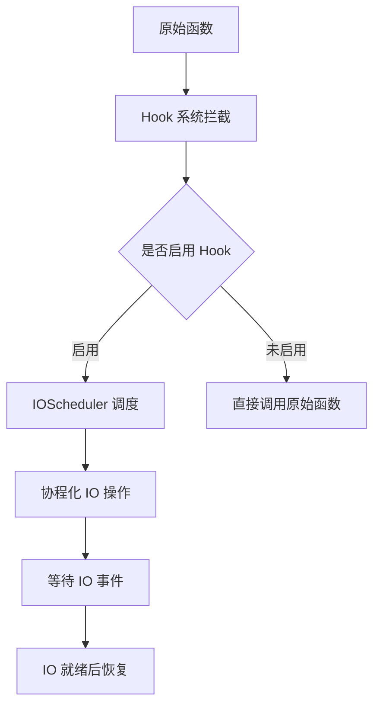

# LoNetfw Hook 系统架构设计

## 架构概览

```
Hook（钩子系统）
    │
    ├─ sleep 相关函数
    │    ├─ sleep()
    │    ├─ usleep()
    │    └─ nanosleep()
    │
    ├─ socket 相关函数
    │    ├─ socket()
    │    ├─ connect()
    │    ├─ accept()
    │    ├─ bind()
    │    └─ closesocket()
    │
    ├─ read 相关函数
    │    ├─ read()
    │    ├─ readv()
    │    ├─ recv()
    │    ├─ recvfrom()
    │    └─ recvmsg()
    │
    ├─ write 相关函数
    │    ├─ write()
    │    ├─ writev()
    │    ├─ send()
    │    ├─ sendto()
    │    └─ sendmsg()
    │
    └─ fd control 相关函数
         ├─ close()
         ├─ fcntl()
         ├─ ioctl()
         ├─ getsockopt()
         └─ setsockopt()
```



---

## 1. 什么是 Hook？（通俗理解）

### 1.1 用生活例子理解 Hook

想象你在餐厅吃饭：

| 场景 | 传统方式（无 Hook） | Hook 方式 |
|------|-------------------|---------|
| 点菜 | 直接喊服务员 | 先登记需求，服务员主动来 |
| 等菜 | 坐在座位傻等 | 可以先去玩手机，菜好了通知你 |
| 结账 | 排队等待 | 先去干其他事，收银台通知你 |

**Hook 就是拦截系统函数，让它变成"非阻塞"的异步操作。**

### 1.2 Hook 的作用

**问题**：传统阻塞式 IO 会阻塞整个线程：

```cpp
// 传统方式（阻塞整个线程）
int sockfd = socket(...);
connect(sockfd, addr, ...);  // 阻塞等待连接完成（可能几秒）
recv(sockfd, buf, len, 0);   // 阻塞等待数据到达（可能几秒）
send(sockfd, buf, len, 0);   // 阻塞等待数据发送（可能几秒）

// 问题：
// 1. 线程被阻塞，不能做其他事
// 2. 需要很多线程才能处理多个连接
// 3. 线程切换开销大
```

**解决**：Hook 后，阻塞函数变成协程化异步操作：

```cpp
// Hook 方式（协程化，不阻塞线程）
int sockfd = socket(...);
connect(sockfd, addr, ...);  // Hook 后：
    // → 如果需要等待，协程让出（yield）
    // → 线程去执行其他协程
    // → 连接就绪后，协程恢复（resume）

recv(sockfd, buf, len, 0);   // Hook 后：
    // → 如果没有数据，协程让出
    // → 线程去执行其他协程
    // → 数据到达后，协程恢复

send(sockfd, buf, len, 0);   // Hook 后：
    // → 如果缓冲区满，协程让出
    // → 线程去执行其他协程
    // → 缓冲区有空位后，协程恢复
```

---

## 2. Hook 的核心概念（详细解释）

### 2.1 Hook 的实现原理

**Hook 的本质**：替换系统函数，用自己的实现替代原始函数。

```
┌─────────────────────────────────────────────────┐
│              函数调用流程                         │
│                                                 │
│  用户调用 recv()                                │
│       ↓                                         │
│  Hook 拦截                                      │
│       ↓                                         │
│  检查是否启用 Hook                               │
│       ├─ 未启用 → 直接调用原始 recv()            │
│       ├─ 启用 →                                  │
│           ↓                                     │
│       检查 socket 是否有数据                     │
│           ├─ 有数据 → 直接读取返回               │
│           ├─ 无数据 →                            │
│               ↓                                 │
│           注册 IO 事件（可读）                   │
│               ↓                                 │
│           协程让出（yieldToHold）                │
│               ↓                                 │
│           线程执行其他协程                       │
│               ↓                                 │
│           数据到达 → epoll 触发                  │
│               ↓                                 │
│           协程恢复，继续读取                     │
└─────────────────────────────────────────────────┘
```

### 2.2 跨平台实现

**Windows 实现**：使用 MinHook 库进行函数 Hook

```cpp
// Windows Hook 实现
#include <MinHook.h>

// Hook connect 函数
MH_CreateHookApi("ws2_32.dll", "connect", &HookConnect, (LPVOID*)&connect_f);
MH_EnableHook(MH_ALL_HOOKS);

// Hook 后的 connect 实现
int HookConnect(SOCKET s, const sockaddr* addr, int addrlen) {
    if (!HookState::isEnable()) {
        return connect_f(s, addr, addrlen);  // 未启用，调用原始函数
    }
    
    // 启用了 Hook
    if (sock_is_nonblock(s)) {
        return connect_f(s, addr, addrlen);  // 非阻塞 socket，直接调用
    }
    
    // 阻塞 socket，协程化
    return connect_with_timeout(s, addr, addrlen, timeout);
}
```

**Linux 实现**：使用 dlsym 获取原始函数地址

```cpp
// Linux Hook 实现
#include <dlfcn.h>

// Hook connect 函数
connect_f = (connect_fun)dlsym(RTLD_NEXT, "connect");

// Hook 后的 connect 实现（类似 Windows）
```

### 2.3 被 Hook 的函数列表

| 类别 | 函数 | Hook 后的行为 |
|------|------|--------------|
| **sleep** | sleep, usleep, nanosleep | 添加定时器，协程让出，定时器触发后恢复 |
| **socket** | socket, accept | 设置为非阻塞模式 |
| **connect** | connect | 注册写事件，协程让出，连接就绪后恢复 |
| **read** | read, recv, recvfrom, recvmsg | 注册读事件，协程让出，数据到达后恢复 |
| **write** | write, send, sendto, sendmsg | 注册写事件，协程让出，可写后恢复 |
| **close** | close, closesocket | 取消所有 IO 事件，关闭 socket |

### 2.4 Hook 的条件判断

**Hook 不是无条件拦截，而是有条件判断：**

```cpp
// Hook 的条件判断流程
CHECK_HOOK(recv_f, sockfd, buf, len, flags);

if (!HookState::isEnable()) {
    // Hook 未启用 → 直接调用原始函数
    return recv_f(sockfd, buf, len, flags);
}

if (sock_is_nonblock(sockfd)) {
    // Socket 已经是非阻塞 → 直接调用原始函数
    // （用户自己管理非阻塞，不需要 Hook）
    return recv_f(sockfd, buf, len, flags);
}

if (IOScheduler::getThis() == nullptr) {
    // 不在 IO 调度器中 → 直接调用原始函数
    // （没有调度器管理，不能协程化）
    return recv_f(sockfd, buf, len, flags);
}

// 以上条件都不满足 → Hook 协程化
return hook_recv(sockfd, buf, len, flags);
```

**Hook 的三个条件**：

| 条件 | 说明 |
|------|------|
| HookState::isEnable() | Hook 系统是否启用 |
| sock_is_nonblock() | Socket 是否已经是非阻塞 |
| IOScheduler::getThis() | 是否在 IO 调度器中 |

---

## 3. 核心代码详解

### 3.1 Hook 类

```cpp
class Hook {
public:
    Hook();
    ~Hook();
    
    static Hook& Instance();  // 单例模式
    
    static void enable();   // 启用 Hook
    static void disable();  // 禁用 Hook
};

// 全局静态实例（确保程序启动时就 Hook）
static auto s_hook = Hook::Instance();
```

### 3.2 connect_with_timeout 实现

```cpp
// Hook 后的 connect 实现（带超时）
int connect_with_timeout(int sockfd, const sockaddr* addr, socklen_t addrlen, int64_t timeout_ms) {
    // 1. 设置 socket 为非阻塞
    set_nonblock(sockfd);
    
    // 2. 尝试连接
    int ret = connect_f(sockfd, addr, addrlen);
    if (ret == 0) {
        // 连接成功（很少见，一般会返回 EINPROGRESS）
        return 0;
    }
    
    // 3. 等待连接完成
    IOScheduler* ios = IOScheduler::getThis();
    
    // 注册写事件（连接成功后会触发写事件）
    ios->addEvent(sockfd, IOScheduler::WRITE, []() {
        // 连接完成，恢复协程
    });
    
    // 如果有超时，添加定时器
    if (timeout_ms > 0) {
        ios->addTimer(timeout_ms, [sockfd]() {
            // 超时，取消 IO 事件
            ios->cancelAll(sockfd);
        });
    }
    
    // 4. 协程让出，等待连接完成
    Fiber::yieldToHold();
    
    // 5. 检查结果
    int error = 0;
    getsockopt(sockfd, SOL_SOCKET, SO_ERROR, &error, &len);
    
    if (error == 0) {
        return 0;  // 连接成功
    } else {
        return -1; // 连接失败
    }
}
```

### 3.3 recv 实现

```cpp
// Hook 后的 recv 实现
ssize_t recv(int sockfd, void* buf, size_t len, int flags) {
    // 条件检查
    CHECK_HOOK(recv_f, sockfd, buf, len, flags);
    
    // 1. 尝试读取（可能已经有数据）
    ssize_t ret = recv_f(sockfd, buf, len, flags);
    if (ret >= 0) {
        return ret;  // 有数据，直接返回
    }
    
    // 2. 没有数据，需要等待
    IOScheduler* ios = IOScheduler::getThis();
    
    // 注册读事件
    ios->addEvent(sockfd, IOScheduler::READ, []() {
        // 数据到达，恢复协程
    });
    
    // 3. 协程让出，等待数据
    Fiber::yieldToHold();
    
    // 4. 数据到达，再次尝试读取
    return recv_f(sockfd, buf, len, flags);
}
```

---

## 4. 使用示例（详细注释）

### 4.1 自动 Hook（推荐）

**最简单的使用方式**：不需要手动调用 Hook，程序启动时自动 Hook。

```cpp
#include "lonetfw/lonetfw.h"

// 创建 IO 调度器（Hook 自动启用）
auto ios = std::make_shared<lon::scheduler::IOScheduler>(2, true, "io");

void client_task() {
    // 创建 socket
    int sockfd = socket(AF_INET, SOCK_STREAM, 0);
    
    // 连接服务器（自动协程化）
    sockaddr_in addr;
    addr.sin_family = AF_INET;
    addr.sin_port = htons(8080);
    inet_pton(AF_INET, "127.0.0.1", &addr.sin_addr);
    
    connect(sockfd, (sockaddr*)&addr, sizeof(addr));  // Hook 后：协程让出，不阻塞线程
    
    // 发送数据（自动协程化）
    char buf[] = "Hello";
    send(sockfd, buf, sizeof(buf), 0);  // Hook 后：协程让出，不阻塞线程
    
    // 接收数据（自动协程化）
    char recv_buf[1024];
    recv(sockfd, recv_buf, sizeof(recv_buf), 0);  // Hook 后：协程让出，不阻塞线程
    
    std::cout << "收到: " << recv_buf << std::endl;
    
    close(sockfd);
}

// 添加任务
ios->schedule(client_task);

// 启动调度器
ios->start();
```

### 4.2 手动控制 Hook

```cpp
#include "hook/hook.h"

void manual_hook_example() {
    // 禁用 Hook
    lon::hook::Hook::disable();
    
    // 禁用后，所有函数都是原始阻塞行为
    sleep(1);  // 真正阻塞 1 秒
    
    // 启用 Hook
    lon::hook::Hook::enable();
    
    // 启用后，函数会协程化（如果满足条件）
    sleep(1);  // Hook 后：添加定时器，协程让出，1秒后恢复
}
```

### 4.3 结合 IOScheduler 使用

```cpp
#include "scheduler/ioscheduler.h"
#include "hook/hook.h"
#include "net/address.h"

void http_client() {
    // 解析地址
    lon::net::Address::Ptr addr;
    lon::net::Address::parse(addr, "www.example.com:80", AF_INET);
    
    // 创建 socket
    int sockfd = socket(AF_INET, SOCK_STREAM, 0);
    
    // 连接（自动 Hook）
    connect(sockfd, addr->getAddr(), addr->getAddrLen());
    
    // 发送 HTTP 请求
    std::string request = "GET / HTTP/1.1\r\nHost: www.example.com\r\n\r\n";
    send(sockfd, request.c_str(), request.size(), 0);
    
    // 接收响应
    char buf[4096];
    ssize_t n = recv(sockfd, buf, sizeof(buf), 0);
    
    std::cout << "响应: " << std::string(buf, n) << std::endl;
    
    close(sockfd);
}

int main() {
    // 创建 IO 调度器（Hook 自动启用）
    auto ios = lon::scheduler::IOScheduler::Ptr(
        new lon::scheduler::IOScheduler(2, true, "http_client")
    );
    
    ios->schedule(http_client);
    ios->start();
    
    return 0;
}
```

---

## 5. Hook 的条件详解

### 5.1 Hook 启用条件

**Hook 何时生效**：需要满足三个条件：

```cpp
// Hook 条件判断（伪代码）
if (Hook 启用 && Socket 阻塞 && 在 IO 调度器中) {
    // Hook 生效，协程化
} else {
    // Hook 不生效，调用原始函数
}
```

**三个条件的意义**：

| 条件 | 为什么需要 | 如何满足 |
|------|-----------|---------|
| Hook 启用 | 用户可能想禁用 Hook | Hook::enable() / Hook::disable() |
| Socket 阻塞 | 非阻塞 socket 用户自己管理 | 默认创建的 socket 是阻塞的 |
| 在 IO 调度器中 | 需要调度器管理协程 | 在 IOScheduler::schedule() 的任务中 |

### 5.2 非 Hook 模式

**什么时候不会 Hook**：

```cpp
// 1. Hook 禁用时
lon::hook::Hook::disable();
recv(sockfd, buf, len, 0);  // 直接调用原始 recv，阻塞

// 2. Socket 已经是非阻塞时
fcntl(sockfd, F_SETFL, O_NONBLOCK);
recv(sockfd, buf, len, 0);  // 直接调用原始 recv，不阻塞（用户自己管理）

// 3. 不在 IO 调度器中时（例如在 main 函数中）
int main() {
    recv(sockfd, buf, len, 0);  // 直接调用原始 recv，阻塞
}

// 4. 没有创建 IO 调度器时
recv(sockfd, buf, len, 0);  // 直接调用原始 recv，阻塞
```

---

## 6. 常见问题解答

### Q1: Hook 和非阻塞 socket 有什么区别？

| 对比项 | Hook | 非阻塞 socket |
|--------|------|--------------|
| 用户代码 | 同步代码（简洁） | 异步代码（复杂） |
| 调度 | 自动调度 | 手动管理 |
| 适用场景 | 协程框架 | 传统异步框架 |

**比喻**：
- Hook = 自动驾驶（你只管说目的地）
- 非阻塞 = 手动驾驶（你要自己控制）

### Q2: Hook 会影响性能吗？

**答**：不会，反而会提升性能：

| 方式 | 单线程处理连接数 | 切换开销 |
|------|----------------|---------|
| 传统阻塞式 | 几百个 | 线程切换（大） |
| Hook 协程化 | 几万个 | 协程切换（小） |

### Q3: 所有函数都会被 Hook 吗？

**答**：不是，只有满足条件才会 Hook：

```cpp
// 不会被 Hook 的情况：
// 1. Hook 禁用
// 2. Socket 非阻塞
// 3. 不在 IO 调度器中
```

### Q4: Hook 和 epoll 有什么关系？

**答**：Hook 依赖 epoll：

```
Hook recv()
    ↓
没有数据 → 注册读事件到 epoll
    ↓
协程让出
    ↓
epoll_wait 返回（数据到达）
    ↓
恢复协程
```

---

## 7. 总结

### Hook 的本质

**Hook = 将阻塞函数变成协程化异步函数**

- 用户写同步代码
- Hook 拦截函数
- 协程让出不阻塞线程
- IO 就绪后自动恢复

### Hook 的核心机制

| 机制 | 作用 |
|------|------|
| 函数拦截 | 替换系统函数 |
| 条件判断 | 决定是否 Hook |
| 协程让出 | 不阻塞线程 |
| IO 注册 | 等待 IO 就绪 |
| 协程恢复 | IO 就绪后继续 |

### Hook 的优势

1. **代码简洁**：用同步代码写异步逻辑
2. **高性能**：单线程处理大量连接
3. **透明**：用户不需要关心细节
4. **灵活**：可以禁用 Hook 使用原始函数

### 与协程和调度器的关系

```
Fiber（协程）= 执行单元
IOScheduler（调度器）= 管理单元
Hook（钩子）= 拦截单元

三者配合：
Hook 拦截阻塞函数 → 调度器注册 IO 事件 → 协程让出
IO 就绪 → 调度器通知 → 协程恢复

实现高性能异步编程
```