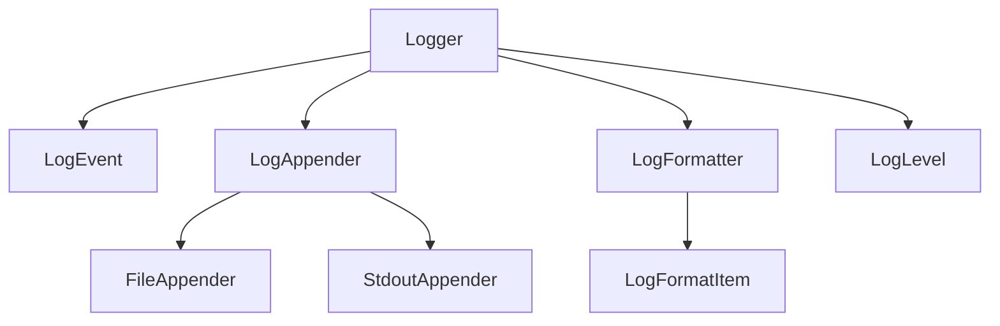

# LoNetfw 日志系统架构设计
架构
LoggerManager
    ├─Logger:LogEvent ├─LoggerA ├─LoggerB ...
        ├─LogAppender 
            ├─LogFormatter:LogFormatItemA, LogFormatItemB, ...


## 1. 系统概述
日志系统提供多级别、高性能的日志记录功能，支持：
- 多日志级别(DEBUG/INFO/WARN/ERROR/FATAL)
- 高性能异步日志记录
- 自定义日志格式
- 多种日志输出方式

## 2. 核心组件

### 2.1 Logger (logger.h/logger.cpp)
- 日志记录器核心类
- 管理日志级别和Appender集合
- 提供日志记录接口
- 线程安全设计

### 2.2 LogEvent (logevent.h/logevent.cpp)
- 日志事件封装
- 包含日志内容、时间、线程ID等信息
- 支持流式日志记录

### 2.3 LogAppender (logappender.h/logappender.cpp)
- 日志输出抽象基类
- 支持多种输出方式(文件/控制台等)
- 可扩展新的输出方式

### 2.4 LogFormatter (logformatter.h/logformatter.cpp)
- 日志格式控制
- 支持自定义格式字符串
- 内置多种格式项(时间、文件、行号等)

### 2.5 LogLevel (loglevel.h/loglevel.cpp)
- 日志级别定义和管理
- 支持级别比较和转换

## 3. 使用示例

```cpp
#include "log/logger.h"

// 基本使用
LON_INFO(LON_LOG_ROOT) << "This is an info log";

// 带性能测试的日志
void test_log() {
    auto start = std::chrono::high_resolution_clock::now();
    for(int i=0; i<100000; ++i) {
        LON_INFO(LON_LOG_NAME("root")) << "test";
    }
    auto end = std::chrono::high_resolution_clock::now();
    LON_INFO(LON_LOG_ROOT) << "Duration: " 
        << std::chrono::duration_cast<std::chrono::microseconds>(end-start).count() << "us";
}
```

## 4. 性能优化
- 使用异步日志记录减少I/O阻塞
- 流式日志记录减少临时对象创建
- 线程局部存储减少锁竞争

## 5. 扩展接口
- 实现新的LogAppender支持更多输出方式
- 自定义LogFormatItem支持特殊格式
- 通过配置文件动态调整日志级别