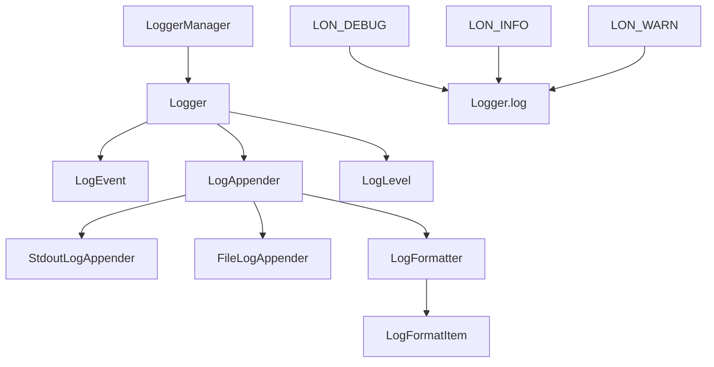

# LoNetfw 日志系统架构设计

## 架构概览

```
Log 日志系统
    │
    ├─ Logger（日志记录器）
    │    ├─ 日志级别管理
    │    ├─ Appender 集合管理
    │    └─ log() 日志记录接口
    │
    ├─ LogAppender（日志输出器）
    │    ├─ StdoutLogAppender（控制台输出）
    │    ├─ FileLogAppender（文件输出）
    │    └─ LogFormatter（格式化器）
    │
    ├─ LogEvent（日志事件）
    │    ├─ 日志内容
    │    ├─ 时间/文件名/行号
    │    ├─ 线程ID/协程ID
    │    └─ 流式输出接口
    │
    ├─ LogFormatter（格式化器）
    │    ├─ 格式字符串解析
    │    └─ LogFormatItem（格式项）
    │
    ├─ LogLevel（日志级别）
    │    ├─ DEBUG / INFO / WARN
    │    ├─ ERROR / FATAL
    │    └─ 级别比较与转换
    │
    └─ LoggerManager（日志管理器）
         └─ 管理多个 Logger 实例
```



---

## 1. 什么是日志系统？（通俗理解）

### 1.1 用生活例子理解日志

想象一个录音笔：

| 场景 | 传统方式（无日志） | 日志系统 |
|------|-------------------|---------|
| 记录事件 | 靠记忆 | 自动记录 |
| 查找问题 | 盲目调试 | 查看日志 |
| 分析原因 | 猜测 | 有据可查 |

**日志系统就是程序的"黑匣子"，记录程序运行时的所有重要事件。**

### 1.2 日志系统的作用

| 作用 | 说明 |
|------|------|
| **调试** | 定位程序问题 |
| **监控** | 监控程序运行状态 |
| **审计** | 记录重要操作 |
| **分析** | 分析性能瓶颈 |

---

## 2. 核心组件详解

### 2.1 Logger（日志记录器）

**Logger 是日志记录的核心类：**

```cpp
class Logger {
public:
    using Ptr = std::shared_ptr<Logger>;
    
    Logger(const std::string& name, LogLevel::Level level);
    
    // 添加输出器
    void addAppender(LogAppender::Ptr appender);
    
    // 删除输出器
    void delAppender(LogAppender::Ptr appender);
    
    // 清空输出器
    void clearAppenders();
    
    // 记录日志
    void log(LogLevel::Level level, LogEvent::Ptr event);
    
    // 设置/获取日志级别
    void setLevel(LogLevel::Level level);
    LogLevel::Level getLevel() const;
    
    // 获取名称
    const std::string& getName() const;
    
private:
    std::string m_name;                      // 日志器名称
    LogLevel::Level m_level;                 // 日志级别
    std::list<LogAppender::Ptr> m_appenders; // 输出器列表
    Mutex m_mutex;                           // 互斥锁
};
```

### 2.2 LogAppender（日志输出器）

**LogAppender 定义日志输出方式：**

```cpp
class LogAppender {
public:
    using Ptr = std::shared_ptr<LogAppender>;
    
    virtual ~LogAppender() = default;
    
    // 输出日志（纯虚函数）
    virtual void log(Logger::Ptr logger, LogLevel::Level level, LogEvent::Ptr event) = 0;
    
    // 设置/获取日志级别
    void setLevel(LogLevel::Level level);
    LogLevel::Level getLevel() const;
    
    // 设置格式化器
    void setFormatter(LogFormatter::Ptr formatter);
    LogFormatter::Ptr getFormatter() const;
    
protected:
    LogLevel::Level m_level = LogLevel::DEBUG;
    LogFormatter::Ptr m_formatter;
    Mutex m_mutex;
};

// 控制台输出器
class StdoutLogAppender : public LogAppender {
    void log(...) override {
        std::cout << m_formatter->format(event);
    }
};

// 文件输出器
class FileLogAppender : public LogAppender {
    void log(...) override {
        m_filestream << m_formatter->format(event);
    }
private:
    std::ofstream m_filestream;
};
```

### 2.3 LogEvent（日志事件）

**LogEvent 封装单条日志的所有信息：**

```cpp
class LogEvent {
public:
    using Ptr = std::shared_ptr<LogEvent>;
    
    LogEvent(
        LogLevel::Level level,
        const std::string& file,
        uint32_t line,
        uint32_t elapse,
        uint32_t thread_id,
        uint32_t fiber_id,
        uint64_t time,
        const std::string& thread_name
    );
    
    // 获取信息
    LogLevel::Level getLevel() const;
    const std::string& getFile() const;
    uint32_t getLine() const;
    uint32_t getThreadId() const;
    uint32_t getFiberId() const;
    uint64_t getTime() const;
    const std::string& getThreadName() const;
    
    // 获取内容
    std::string getContent() const;
    std::stringstream& getMessageStream();
    
private:
    LogLevel::Level m_level;       // 日志级别
    std::string m_file;            // 文件名
    uint32_t m_line;               // 行号
    uint32_t m_elapse;             // 程序启动到现在的毫秒数
    uint32_t m_threadId;           // 线程ID
    uint32_t m_fiberId;            // 协程ID
    uint64_t m_time;               // 时间戳
    std::string m_threadName;      // 线程名
    std::stringstream m_ss;        // 日志内容流
};
```

### 2.4 LogFormatter（格式化器）

**LogFormatter 控制日志输出格式：**

```cpp
class LogFormatter {
public:
    using Ptr = std::shared_ptr<LogFormatter>;
    
    LogFormatter(const std::string& pattern);
    
    // 格式化日志事件
    std::string format(LogEvent::Ptr event);
    
private:
    std::string m_pattern;                   // 格式模式
    std::vector<LogFormatItem::Ptr> m_items; // 格式项列表
};

// 格式项（基类）
class LogFormatItem {
public:
    virtual ~LogFormatItem() = default;
    virtual void format(std::ostream& os, LogEvent::Ptr event) = 0;
};

// 具体格式项示例
class TimeFormatItem : public LogFormatItem {
    void format(std::ostream& os, LogEvent::Ptr event) override {
        os << event->getTime();
    }
};

class FileFormatItem : public LogFormatItem {
    void format(std::ostream& os, LogEvent::Ptr event) override {
        os << event->getFile();
    }
};
```

### 2.5 LogLevel（日志级别）

**LogLevel 定义日志级别：**

```cpp
class LogLevel {
public:
    enum Level {
        DEBUG = 0,  // 调试信息
        INFO  = 1,  // 一般信息
        WARN  = 2,  // 警告
        ERROR = 3,  // 错误
        FATAL = 4,  // 致命错误
    };
    
    // 转换为字符串
    static const char* toString(Level level);
    
    // 从字符串解析
    static Level fromString(const std::string& str);
};
```

### 2.6 LoggerManager（日志管理器）

**LoggerManager 管理多个 Logger 实例：**

```cpp
class LoggerManager {
public:
    // 获取日志器
    Logger::Ptr getLogger(const std::string& name);
    
    // 设置日志器
    void setLogger(const std::string& name, Logger::Ptr logger);
    
    // 获取根日志器
    Logger::Ptr getRoot() const;
    
private:
    std::map<std::string, Logger::Ptr> m_loggers;
    Logger::Ptr m_root;
    Mutex m_mutex;
};

// 全局宏
#define LON_LOG_ROOT lon::log::LoggerManager::Instance().getRoot()
#define LON_LOG_MANAGER lon::log::LoggerManager::Instance()
#define LON_LOG_NAME(name) lon::log::LoggerManager::Instance().getLogger(name)
```

---

## 3. 格式化字符串

### 3.1 支持的格式项

| 格式项 | 说明 | 示例 |
|--------|------|------|
| `%m` | 日志内容 | "hello world" |
| `%p` | 日志级别 | "INFO" |
| `%c` | 日志器名称 | "root" |
| `%d` | 时间 | "2024-01-01 12:00:00" |
| `%t` | 线程ID | "12345" |
| `%N` | 线程名 | "thread-1" |
| `%F` | 协程ID | "100" |
| `%f` | 文件名 | "main.cpp" |
| `%l` | 行号 | "42" |
| `%n` | 换行符 | "\n" |
| `%T` | 制表符 | "\t" |
| `%%` | 百分号 | "%" |

### 3.2 格式化示例

```cpp
// 格式：时间 制表符 线程ID 制表符 线程名 制表符 协程ID 制表符 [级别] 制表符 [日志器] 制表符 文件:行号 制表符 内容 换行
"%d{%Y-%m-%d %H:%M:%S}%T%t%T%N%T%F%T[%p]%T[%c]%T%f:%l%T%m%n"

// 输出示例：
// 2024-01-01 12:00:00	12345	thread-1	100	[INFO]	[root]	main.cpp:42	hello world
```

---

## 4. 日志宏

### 4.1 流式日志宏

```cpp
// 基本使用
LON_DEBUG(logger) << "调试信息" << 123 << 3.14;
LON_INFO(logger) << "一般信息";
LON_WARN(logger) << "警告信息";
LON_ERROR(logger) << "错误信息";
LON_FATAL(logger) << "致命错误";

// 使用根日志器
LON_INFO(LON_LOG_ROOT) << "使用根日志器";

// 使用命名日志器
LON_DEBUG(LON_LOG_NAME("my_logger")) << "使用命名日志器";
```

### 4.2 格式化日志宏

```cpp
// 类似 printf 的格式化输出
LON_DEBUG_FMT(logger, "值: %d, 字符串: %s", 123, "hello");
LON_INFO_FMT(logger, "浮点数: %.2f", 3.14159);
LON_WARN_FMT(logger, "警告: %s", "something wrong");
```

---

## 5. 使用示例（详细注释）

### 5.1 基础使用（参考 tests/main.cpp）

```cpp
#include "log/logger.h"
#include "util/util.h"

using namespace lon;
using namespace log;
using namespace util;

int main(int argc, char const *argv[])
{
    // 1. 创建日志器
    auto logger = std::make_shared<Logger>("test", LogLevel::Level::DEBUG);
    
    // 2. 添加控制台输出器
    logger->addAppender(std::make_shared<StdoutLogAppender>(LogLevel::Level::WARN));
    
    // 3. 添加文件输出器
    auto file_appender = std::make_shared<FileLogAppender>("./.log/test.log");
    
    // 4. 设置格式化器
    file_appender->setFormatter(std::make_shared<LogFormatter>(
        "%d{%Y-%m-%d %H:%M:%S}%T%t%T%N%T%F%T[%p]%T[%c]%T%f:%l%T%m%n"
    ));
    logger->addAppender(file_appender);
    
    // 5. 创建日志事件并记录
    auto event = std::make_shared<LogEvent>(
        LogLevel::DEBUG, 
        std::string(__FILE__), 
        __LINE__, 
        0,
        util::getThreadId(), 
        util::getFiberId(),
        util::getCurrentDateTime(), 
        "thread"
    );
    event->getMessageStream() << "hello lon log";
    logger->log(LogLevel::Level::DEBUG, event);
    
    // 6. 使用宏记录日志
    LON_DEBUG(logger) << "hello lon debug" << 122 << 3.1415926;
    LON_INFO(logger) << "hello lon info";
    LON_WARN(logger) << "hello lon warn";
    LON_ERROR(logger) << "hello lon error";
    LON_FATAL(logger) << "hello lon fatal";
    
    // 7. 使用格式化宏
    LON_DEBUG_FMT(logger, "hello lon debug %s:%d", "123123", 12);
    
    // 8. 使用日志管理器
    LON_LOG_MANAGER.setLogger("test", logger);
    auto root_logger = LON_LOG_MANAGER.getLogger("root");
    if (root_logger != nullptr) {
        LON_DEBUG(root_logger) << "hello from root logger";
    }
    
    return 0;
}
```

### 5.2 多日志器管理

```cpp
#include "log/logger.h"

static auto g_logger = LON_LOG_ROOT;

void multi_logger_example() {
    // 创建多个日志器
    auto http_logger = std::make_shared<lon::log::Logger>("http", lon::log::LogLevel::INFO);
    auto db_logger = std::make_shared<lon::log::Logger>("database", lon::log::LogLevel::WARN);
    
    // 配置不同的输出方式
    http_logger->addAppender(std::make_shared<lon::log::FileLogAppender>("./logs/http.log"));
    db_logger->addAppender(std::make_shared<lon::log::FileLogAppender>("./logs/database.log"));
    
    // 注册到管理器
    LON_LOG_MANAGER.setLogger("http", http_logger);
    LON_LOG_MANAGER.setLogger("database", db_logger);
    
    // 使用不同日志器
    LON_INFO(LON_LOG_NAME("http")) << "HTTP 请求处理";
    LON_WARN(LON_LOG_NAME("database")) << "数据库连接超时";
    
    // 也可以使用全局日志器
    LON_INFO(g_logger) << "应用日志";
}
```

### 5.3 日志级别过滤

```cpp
#include "log/logger.h"

void log_level_example() {
    auto logger = std::make_shared<lon::log::Logger>("test", lon::log::LogLevel::INFO);
    
    // 设置日志级别为 INFO
    logger->setLevel(lon::log::LogLevel::INFO);
    
    // DEBUG 级别的日志不会被输出（低于 INFO）
    LON_DEBUG(logger) << "这条不会输出";
    
    // INFO 及以上级别会输出
    LON_INFO(logger) << "这条会输出";   // ✓ 输出
    LON_WARN(logger) << "这条会输出";   // ✓ 输出
    LON_ERROR(logger) << "这条会输出";  // ✓ 输出
    
    // 设置日志级别为 ERROR
    logger->setLevel(lon::log::LogLevel::ERROR);
    
    LON_INFO(logger) << "这条不会输出";  // ✗ 不输出
    LON_WARN(logger) << "这条不会输出";  // ✗ 不输出
    LON_ERROR(logger) << "这条会输出";  // ✓ 输出
}
```

### 5.4 自定义格式

```cpp
#include "log/logger.h"

void custom_format_example() {
    auto logger = std::make_shared<lon::log::Logger>("custom", lon::log::LogLevel::DEBUG);
    
    // 简单格式
    auto simple_formatter = std::make_shared<lon::log::LogFormatter>("[%p] %m%n");
    auto simple_appender = std::make_shared<lon::log::StdoutLogAppender>();
    simple_appender->setFormatter(simple_formatter);
    logger->addAppender(simple_appender);
    
    // 输出：[INFO] hello world
    
    // 详细格式
    auto detail_formatter = std::make_shared<lon::log::LogFormatter>(
        "%d{%Y-%m-%d %H:%M:%S} [%p] [%c] %f:%l - %m%n"
    );
    auto file_appender = std::make_shared<lon::log::FileLogAppender>("./logs/detail.log");
    file_appender->setFormatter(detail_formatter);
    logger->addAppender(file_appender);
    
    // 输出：2024-01-01 12:00:00 [INFO] [custom] main.cpp:42 - hello world
}
```

---

## 6. 性能优化

### 6.1 异步日志

```cpp
// 日志输出在独立线程中进行，不阻塞主线程
// FileLogAppender 内部使用缓冲区，批量写入文件
```

### 6.2 流式输出

```cpp
// 使用 stringstream，减少临时对象创建
LON_INFO(logger) << "值: " << 123 << ", 字符串: " << "hello";
```

### 6.3 线程安全

```cpp
// Logger 和 LogAppender 都使用互斥锁保护
// 多线程环境下安全使用
```

---

## 7. 常见问题解答

### Q1: Logger 和 LogAppender 的日志级别有什么区别？

| 对比项 | Logger 级别 | Appender 级别 |
|--------|------------|---------------|
| 作用 | 过滤日志事件 | 过滤输出内容 |
| 范围 | 整个日志器 | 单个输出器 |

```cpp
// Logger 级别：决定哪些日志事件会被处理
logger->setLevel(LogLevel::INFO);  // 只处理 INFO 及以上

// Appender 级别：决定哪些日志内容会被输出
file_appender->setLevel(LogLevel::WARN);  // 只输出 WARN 及以上
```

### Q2: 如何输出到多个文件？

```cpp
auto logger = std::make_shared<Logger>("multi", LogLevel::DEBUG);

// 输出到普通日志文件
auto normal_appender = std::make_shared<FileLogAppender>("./logs/normal.log");
normal_appender->setLevel(LogLevel::INFO);
logger->addAppender(normal_appender);

// 输出到错误日志文件
auto error_appender = std::make_shared<FileLogAppender>("./logs/error.log");
error_appender->setLevel(LogLevel::ERROR);
logger->addAppender(error_appender);

// INFO 级别只输出到 normal.log
// ERROR 级别同时输出到两个文件
```

### Q3: 日志文件如何按天分割？

需要自定义 LogAppender 或使用日志轮转工具。

### Q4: 如何关闭日志？

```cpp
// 方式1：设置级别为 FATAL（只输出致命错误）
logger->setLevel(LogLevel::FATAL);

// 方式2：清空所有 Appender
logger->clearAppenders();
```

---

## 8. 总结

### 日志系统的本质

**日志系统 = 程序的"黑匣子"**

- 记录程序运行时的所有重要事件
- 提供调试、监控、审计、分析功能
- 多级别、高性能、可扩展

### 日志系统的核心机制

| 机制 | 作用 |
|------|------|
| Logger | 日志记录器 |
| LogAppender | 日志输出器 |
| LogEvent | 日志事件 |
| LogFormatter | 格式化器 |
| LogLevel | 日志级别 |
| LoggerManager | 日志管理器 |

### 日志系统的优势

1. **多级别**：DEBUG/INFO/WARN/ERROR/FATAL
2. **灵活输出**：控制台、文件、网络等
3. **自定义格式**：支持丰富的格式项
4. **线程安全**：多线程环境下安全使用
5. **高性能**：异步日志、流式输出

### 与其他模块的关系

```
Log（日志系统）
    ↓
被所有模块使用
    ├─ Fiber（记录协程状态）
    ├─ Scheduler（记录调度事件）
    ├─ HttpService（记录 HTTP 请求）
    └─ System（记录系统事件）
```