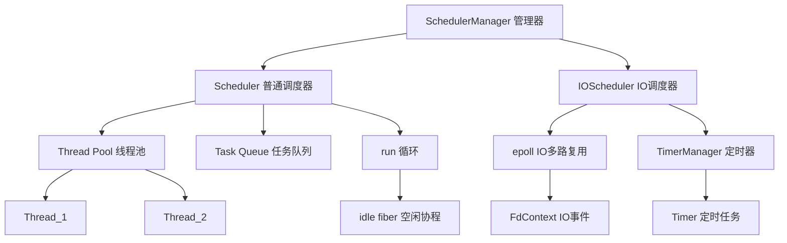

# LoNetfw 调度器系统架构设计

## 架构概览

```
SchedulerManager（调度器管理器 - 单例）
    │
    ├─ Scheduler_1（普通调度器）
    │    ├─ Thread_1 → Fiber(run) → 执行任务
    │    ├─ Thread_2 → Fiber(run) → 执行任务
    │    ├─ Thread_3 → Fiber(run) → 执行任务
    │    └─ TaskQueue（任务队列）
    │
    ├─ Scheduler_2（普通调度器）
    │    └─ ...
    │
    └─ IOScheduler（IO调度器 - 继承 Scheduler + TimerManager）
         │
         ├─ Thread Pool（线程池）
         ├─ epoll（IO 多路复用）
         ├─ TimerManager（定时器管理）
         │    └─ Timer_1, Timer_2, Timer_3...
         └
         └─ FdContext（文件描述符上下文）
              ├─ fd=100 → READ事件 → Fiber_A
              ├─ fd=101 → WRITE事件 → Fiber_B
              └─ ...
```



---

## 1. 什么是调度器？（通俗理解）

### 1.1 用生活例子理解调度器

想象一个餐厅：

| 角色 | 对应概念 | 作用 |
|------|---------|------|
| 餐厅经理 | SchedulerManager | 管理多个调度器 |
| 服务员团队 | Scheduler | 一个调度器实例 |
| 服务员 | Thread | 执行任务的线程 |
| 顾客订单 | Task | 需要执行的任务 |
| 订单队列 | TaskQueue | 等待执行的任务 |
| 做菜 | Fiber 执行 | 实际干活 |

**调度器的工作流程**：

```
顾客下单（添加任务）
    ↓
订单进入队列（TaskQueue）
    ↓
服务员从队列取订单（Thread.run）
    ↓
服务员做菜（Fiber 执行）
    ↓
做完了，取下一个订单
    ↓
没订单了，服务员休息（idle fiber）
```

### 1.2 为什么需要调度器？

**没有调度器时（手动管理协程）**：

```cpp
// 你需要手动切换每个协程
Fiber::Ptr f1 = new Fiber(task1);
Fiber::Ptr f2 = new Fiber(task2);
Fiber::Ptr f3 = new Fiber(task3);

f1->swapIn();  // 手动切换
f2->swapIn();  // 手动切换
f3->swapIn();  // 手动切换

// 问题：
// 1. 需要手动管理所有协程
// 2. 不知道哪个协程该先执行
// 3. 协程让出后，谁来决定下一个执行哪个？
```

**有调度器时（自动管理）**：

```cpp
// 只需要添加任务，调度器自动管理
scheduler->schedule(task1);
scheduler->schedule(task2);
scheduler->schedule(task3);

// 调度器自动：
// 1. 创建协程执行任务
// 2. 决定执行顺序
// 3. 协程让出后，自动调度下一个
```

---

## 2. 调度器的核心概念（详细解释）

### 2.1 任务（Task）

**任务是什么？**

任务就是"需要执行的工作"，有两种形式：

| 类型 | 说明 | 调度器处理方式 |
|------|------|---------------|
| **协程任务** | 已经创建好的 Fiber | 直接调度执行 |
| **回调任务** | 一个函数（callback） | 自动创建 Fiber 执行 |

```cpp
struct Task {
    Fiber::Ptr fiber;           // 协程（可能为空）
    std::function<void()> cb;   // 回调函数（可能为空）
    int thread_id;              // 指定执行线程（-1 = 任意线程）
};
```

**示例**：

```cpp
// 协程任务
Fiber::Ptr fiber = new Fiber([]() {
    // 任务代码
});
scheduler->schedule(fiber);  // 添加协程任务

// 回调任务
scheduler->schedule([]() {
    // 任务代码
});  // 调度器自动创建 Fiber 执行
```

### 2.2 use_caller 模式

**use_caller 是什么？**

决定"调用线程"是否参与任务执行：

| use_caller | 调用线程的角色 | 实际线程数 |
|------------|---------------|-----------|
| **true** | 调用线程也执行任务 | threads_count - 1 个子线程 + 调用线程 |
| **false** | 调用线程只负责调度 | threads_count 个子线程 |

**图解**：

```
use_caller = true（调用线程参与）:
┌────────────────────────────────────────┐
│         Scheduler(4, true)             │
│                                        │
│  调用线程（main）  ← 也执行任务          │
│      ↓                                 │
│  Thread_1  ← 执行任务                   │
│  Thread_2  ← 执行任务                   │
│  Thread_3  ← 执行任务                   │
│                                        │
│  实际执行线程数 = 4                      │
└────────────────────────────────────────┘

use_caller = false（调用线程不参与）:
┌────────────────────────────────────────┐
│         Scheduler(4, false)            │
│                                        │
│  调用线程（main）  ← 只负责调度，不执行   │
│      ↓                                 │
│  Thread_1  ← 执行任务                   │
│  Thread_2  ← 执行任务                   │
│  Thread_3  ← 执行任务                   │
│  Thread_4  ← 执行任务                   │
│                                        │
│  实际执行线程数 = 4                      │
└────────────────────────────────────────┘
```

**使用场景**：

| 场景 | 推荐 use_caller |
|------|----------------|
| 主线程需要处理请求 | true |
| 主线程只做管理 | false |
| 单线程调度器 | true |

### 2.3 调度流程（详细步骤）

**完整调度流程**：

```
步骤1: 创建调度器
─────────────────
Scheduler sched(4, true);
    ↓
创建 3 个子线程（因为 use_caller=true）
    ↓
每个线程创建一个 run 协程


步骤2: 启动调度器
─────────────────
sched.start();
    ↓
启动所有线程
    ↓
每个线程开始 run() 循环


步骤3: 添加任务
─────────────────
sched.schedule(task);
    ↓
任务进入 TaskQueue（加锁）
    ↓
通知线程有新任务（notify）


步骤4: 线程执行循环
─────────────────
Thread.run() {
    while (true) {
        // 取任务
        Task task = 取出任务（加锁）;
        
        if (有任务) {
            // 执行任务
            if (task.fiber) {
                task.fiber->swapIn();  // 执行协程
            } else if (task.cb) {
                创建 Fiber 执行回调;
            }
            
            // 检查状态
            if (fiber 状态 == READY) {
                重新入队;  // 还要继续执行
            } else if (fiber 状态 == HOLD) {
                不入队;  // 等待唤醒
            } else if (fiber 状态 == TERM) {
                结束;  // 可以复用
            }
        } else {
            // 没任务，执行 idle
            idle_fiber->swapIn();
        }
    }
}


步骤5: 空闲处理
─────────────────
idle() {
    while (!stopping()) {
        yieldToHold();  // 让出，等待任务
    }
}


步骤6: 停止调度器
─────────────────
sched.stop();
    ↓
设置 stopping = true
    ↓
通知所有线程
    ↓
等待所有线程结束
```

---

## 3. IO 调度器（IOScheduler）详解

### 3.1 什么是 IO 调度器？

**IO 调度器 = 普通调度器 + IO 事件监听 + 定时器**

```
┌─────────────────────────────────────────────────┐
│              IOScheduler                         │
│                                                 │
│  ┌─────────────┐  ┌─────────────┐  ┌─────────┐ │
│  │ Scheduler   │  │ TimerManager│  │ epoll   │ │
│  │ 任务调度     │  │ 定时任务     │  │ IO监听  │ │
│  └─────────────┘  └─────────────┘  └─────────┘ │
│                                                 │
│  三者协同工作：                                   │
│  - 有任务 → 执行任务                              │
│  - 有 IO → 处理 IO                               │
│  - 有定时器 → 执行定时任务                        │
└─────────────────────────────────────────────────┘
```

### 3.2 IO 事件监听

**什么是 IO 事件？**

IO 事件就是"文件描述符（socket/文件）的状态变化"：

| 事件类型 | 含义 | 什么时候触发 |
|---------|------|-------------|
| **READ** | 可读 | socket 有数据到达、文件可读 |
| **WRITE** | 可写 | socket 可以发送数据、文件可写 |

**epoll 是什么？**

epoll 是 Linux 的高效 IO 监听机制：
- 同时监听成千上万个 socket
- 只返回"有事件"的 socket
- 不需要逐个检查（效率高）

**比喻**：
- 传统方式（select）= 逐个问服务员"有订单吗？"
- epoll 方式 = 服务员主动喊"3号桌有订单！"

### 3.3 IO 事件处理流程

```
步骤1: 注册 IO 事件
─────────────────
io_sched->addEvent(sockfd, READ, callback);
    ↓
创建 FdContext（保存事件信息）
    ↓
epoll_ctl(ADD, sockfd, EPOLLIN)  // 注册到 epoll
    ↓
保存 callback 或 fiber


步骤2: 等待事件
─────────────────
idle() {
    while (true) {
        // 计算超时时间（最近定时器）
        timeout = getNextTimerTimeMs();
        
        // epoll_wait 阻塞等待
        ret = epoll_wait(epoll_fd, events, timeout);
        
        // 处理触发的 IO 事件
        for (event in events) {
            FdContext* ctx = event.data.ptr;
            ctx->triggerEvent(...);
        }
        
        // 处理过期定时器
        getExpiredCbsList(cbs);
        schedule(cbs);  // 添加到任务队列
    }
}


步骤3: 触发事件
─────────────────
socket 可读（数据到达）
    ↓
epoll_wait 返回事件
    ↓
triggerEvent(READ)
    ↓
取出 callback 或 fiber
    ↓
schedule(callback/fiber)  // 添加到任务队列
    ↓
线程执行 callback/fiber
```

### 3.4 FdContext（文件描述符上下文）

**FdContext 是什么？**

每个被监听的 socket 都有一个 FdContext，保存：

```cpp
struct FdContext {
    int fd;                    // socket 文件描述符
    Event event;               // 当前注册的事件（READ/WRITE）
    
    struct EventContext {
        Scheduler* scheduler;  // 哪个调度器
        Fiber::Ptr fiber;      // 触发时执行的协程
        function<void()> cb;   // 触发时执行的回调
    };
    
    EventContext r_event;      // 读事件上下文
    EventContext w_event;      // 写事件上下文
};
```

**示例**：

```cpp
// 注册 socket 100 的读事件
io_sched->addEvent(100, READ, []() {
    char buf[1024];
    recv(100, buf, sizeof(buf));
    std::cout << "收到数据" << std::endl;
});

// FdContext 内部：
FdContext[100] = {
    fd: 100,
    event: READ,
    r_event: {
        scheduler: io_sched,
        cb: []() { recv... }
    }
}

// socket 100 有数据到达时：
// → epoll_wait 返回
// → triggerEvent(READ)
// → 执行 cb（recv 数据）
```

### 3.5 定时器集成

**定时器是什么？**

定时器 = "在指定时间后执行的任务"

| 类型 | 说明 |
|------|------|
| **单次定时器** | 执行一次就结束 |
| **循环定时器** | 每隔一段时间执行一次 |

**定时器管理**：

定时器按"执行时间"排序，最小的在最前面：

```cpp
// TimerManager 内部
std::set<Timer::Ptr, Comparator> m_timers;

// 排序规则：按执行时间排序
// m_timers.begin() 就是最近要执行的定时器
```

**定时器处理流程**：

```
添加定时器
─────────────────
io_sched->addTimer(3000, callback);
    ↓
创建 Timer（3秒后执行）
    ↓
插入 m_timers（按时间排序）
    ↓
如果是最早的 → 通知 epoll_wait


epoll_wait 使用定时器
─────────────────
timeout = getNextTimerTimeMs();  // 最近定时器的时间
epoll_wait(epoll_fd, events, timeout);
    ↓
如果 timeout 时间内没有 IO 事件
    ↓
epoll_wait 返回（超时）
    ↓
getExpiredCbsList(cbs)  // 获取过期定时器
    ↓
schedule(cbs)  // 添加到任务队列执行
```

---

## 4. 核心代码详解

### 4.1 Scheduler 核心代码

**添加任务**：

```cpp
template <typename FiberOrCB>
void schedule(FiberOrCB fc, int thread_id = -1) {
    bool should_notify = false;
    {
        MutexType::Lock lock(m_mutex);
        
        // 任务队列空 → 需要通知线程
        should_notify = m_tasks.empty();
        
        // 创建 Task 并入队
        Task task(fc, thread_id);
        if (task.cb || task.fiber) {
            m_tasks.push_back(task);
        }
    }
    
    // 通知线程有新任务
    if (should_notify) {
        notify();
    }
}
```

**执行循环**：

```cpp
void run() {
    // 设置当前调度器
    setThis();
    
    // 创建 idle 协程
    Fiber::Ptr idle_fiber(new Fiber(std::bind(&idle, this)));
    
    // 创建回调协程（复用）
    Fiber::Ptr cb_fiber;
    
    while (true) {
        Task task;
        bool is_active = false;
        
        // 取任务（加锁）
        {
            MutexType::Lock lock(m_mutex);
            auto it = m_tasks.begin();
            
            // 找一个可以执行的任务
            while (it != m_tasks.end()) {
                // 指定了线程ID，但不是当前线程 → 跳过
                if (it->thread_id != -1 && it->thread_id != getThreadId()) {
                    ++it;
                    continue;
                }
                
                // 协程正在执行 → 跳过
                if (it->fiber && it->fiber->getState() == Fiber::EXEC) {
                    ++it;
                    continue;
                }
                
                // 取出任务
                task = *it;
                m_tasks.erase(it);
                ++m_active_threads_count;
                is_active = true;
                break;
            }
        }
        
        // 执行任务
        if (task.fiber) {
            // 协程任务
            task.fiber->swapIn(getMainFiber());
            --m_active_threads_count;
            
            // 检查状态
            if (task.fiber->getState() == Fiber::READY) {
                schedule(task.fiber);  // 重新入队
            } else if (task.fiber->getState() != Fiber::TERM) {
                task.fiber->setState(Fiber::HOLD);
            }
        } else if (task.cb) {
            // 回调任务
            if (cb_fiber) {
                cb_fiber->reset(task.cb);  // 复用
            } else {
                cb_fiber.reset(new Fiber(task.cb));
            }
            
            cb_fiber->swapIn(getMainFiber());
            --m_active_threads_count;
            
            // 检查状态
            if (cb_fiber->getState() == Fiber::READY) {
                schedule(cb_fiber);
                cb_fiber.reset();
            } else if (cb_fiber->getState() == Fiber::TERM) {
                cb_fiber->reset(nullptr);  // 清空，下次复用
            } else {
                cb_fiber->setState(Fiber::HOLD);
                cb_fiber.reset();
            }
        } else {
            // 没任务，执行 idle
            if (is_active) {
                --m_active_threads_count;
                continue;
            }
            
            ++m_idle_threads_count;
            idle_fiber->swapIn(getMainFiber());
            --m_idle_threads_count;
            
            if (idle_fiber->getState() != Fiber::TERM) {
                idle_fiber->setState(Fiber::HOLD);
            }
        }
    }
}
```

### 4.2 IOScheduler 核心代码

**注册 IO 事件**：

```cpp
int8_t addEvent(int fd, Event event, std::function<void()> cb) {
    // 获取 FdContext
    FdContext* fd_ctx = m_fd_contexts[fd];
    
    // 加锁
    FdContext::MutexType::Lock lock(fd_ctx->mutex);
    
    // 已经有这个事件 → 报错
    if (fd_ctx->event & event) {
        return -1;
    }
    
    // 注册到 epoll
    int op = fd_ctx->event ? EPOLL_CTL_MOD : EPOLL_CTL_ADD;
    epoll_event epevent;
    epevent.events = EPOLLET | fd_ctx->event | event;
    epevent.data.ptr = fd_ctx;
    epoll_ctl(m_epoll_fd, op, fd, &epevent);
    
    // 更新状态
    ++m_waitting_events_count;
    fd_ctx->event = fd_ctx->event | event;
    
    // 保存回调或协程
    auto& event_ctx = fd_ctx->getContext(event);
    event_ctx.scheduler = Scheduler::getThis();
    if (cb) {
        event_ctx.cb = cb;
    } else {
        event_ctx.fiber = Fiber::getThis();
    }
    
    return 0;
}
```

**idle 循环（IO + 定时器）**：

```cpp
void idle() {
    epoll_event events[64];
    
    while (true) {
        // 计算超时时间
        uint64_t timeout = getNextTimerTimeMs();
        
        // 检查是否停止
        if (stopping(timeout)) {
            break;
        }
        
        // epoll_wait 阻塞等待
        int ret = epoll_wait(m_epoll_fd, events, 64, timeout);
        
        // 处理过期定时器
        std::vector<std::function<void()>> cbs;
        getExpiredCbsList(cbs);
        if (!cbs.empty()) {
            schedule(cbs.begin(), cbs.end());
        }
        
        // 处理 IO 事件
        for (int i = 0; i < ret; ++i) {
            epoll_event& event = events[i];
            
            // 通知管道 → 读取并跳过
            if (event.data.fd == m_notify_pipe_fd[0]) {
                read(m_notify_pipe_fd[0], ...);
                continue;
            }
            
            // 触发事件
            FdContext* fd_ctx = (FdContext*)event.data.ptr;
            
            // 处理错误事件
            if (event.events & (EPOLLERR | EPOLLHUP)) {
                event.events |= EPOLLIN | EPOLLOUT;
            }
            
            // 触发读事件
            if (event.events & EPOLLIN) {
                fd_ctx->triggerEvent(READ);
                --m_waitting_events_count;
            }
            
            // 触发写事件
            if (event.events & EPOLLOUT) {
                fd_ctx->triggerEvent(WRITE);
                --m_waitting_events_count;
            }
        }
        
        // 让出，回到调度协程
        Fiber::getThis()->swapOut(Scheduler::getMainFiber());
    }
}
```

---

## 5. 使用示例（详细注释）

### 5.1 基础调度器

```cpp
#include "scheduler/scheduler.h"

void basic_scheduler() {
    // 创建调度器：3线程 + use_caller
    Scheduler::Ptr sched(new Scheduler(3, true, "worker"));
    
    // 启动调度器
    sched->start();
    std::cout << "调度器已启动" << std::endl;
    
    // 添加协程任务
    Fiber::Ptr fiber1(new Fiber([]() {
        std::cout << "任务1 开始" << std::endl;
        Fiber::yieldToReady();  // 让出，稍后继续
        std::cout << "任务1 继续" << std::endl;
    }));
    sched->schedule(fiber1);
    
    // 添加回调任务（自动创建协程）
    sched->schedule([]() {
        std::cout << "任务2 执行" << std::endl;
    });
    
    // 批量添加任务
    std::vector<std::function<void()>> tasks;
    for (int i = 0; i < 10; ++i) {
        tasks.push_back([i]() {
            std::cout << "批量任务 " << i << std::endl;
        });
    }
    sched->schedule(tasks.begin(), tasks.end());
    
    // 等待任务执行
    sleep(2);
    
    // 停止调度器
    sched->stop();
    std::cout << "调度器已停止" << std::endl;
}
```

### 5.2 IO 调度器

```cpp
#include "scheduler/ioscheduler.h"

void io_scheduler_example() {
    // 创建 IO 调度器
    IOScheduler::Ptr io_sched(new IOScheduler(2, true, "io_worker"));
    
    // 创建 socket
    int sockfd = socket(AF_INET, SOCK_STREAM, 0);
    connect(sockfd, ...);
    
    // 注册读事件（方式1：指定回调）
    io_sched->addEvent(sockfd, IOScheduler::READ, []() {
        char buf[1024];
        int n = recv(sockfd, buf, sizeof(buf), 0);
        std::cout << "收到 " << n << " 字节" << std::endl;
        
        // 处理数据...
    });
    
    // 注册写事件（方式2：使用当前协程）
    // 当前协程会在 socket 可写时恢复
    io_sched->addEvent(sockfd, IOScheduler::WRITE);
    Fiber::yieldToHold();  // 让出，等待可写
    
    // 可写了，继续执行
    send(sockfd, "hello", 5, 0);
    
    // 删除事件
    io_sched->delEvent(sockfd, IOScheduler::READ);
    
    // 取消所有事件
    io_sched->cancelAll(sockfd);
}
```

### 5.3 定时器

```cpp
#include "scheduler/ioscheduler.h"

void timer_example() {
    IOScheduler::Ptr io_sched(new IOScheduler(1, true, "timer"));
    
    // 单次定时器（3秒后执行一次）
    io_sched->addTimer(3000, []() {
        std::cout << "3秒定时器触发" << std::endl;
    });
    
    // 循环定时器（每1秒执行一次）
    Timer::Ptr loop_timer = io_sched->addTimer(1000, []() {
        std::cout << "每秒触发" << std::endl;
    }, true);
    
    // 条件定时器（条件失效时自动取消）
    std::shared_ptr<int> condition = std::make_shared<int>(42);
    io_sched->addConditionTimer(2000, []() {
        std::cout << "条件定时器触发" << std::endl;
    }, condition);
    
    // 5秒后，condition 被销毁
    // → 条件定时器自动取消
    
    // 手动取消循环定时器
    sleep(5);
    loop_timer->cancel();
    
    // 刷新定时器（重新计时）
    loop_timer->refresh();
    
    // 重置定时器参数
    loop_timer->reset(2000, true);  // 改为2秒，从现在开始
}
```

### 5.4 调度器管理器

```cpp
#include "scheduler/schedulermanager.h"

void manager_example() {
    // 创建多个调度器
    IOScheduler::Ptr http_sched(new IOScheduler(4, true, "http"));
    IOScheduler::Ptr ws_sched(new IOScheduler(2, true, "websocket"));
    Scheduler::Ptr bg_sched(new Scheduler(2, false, "background"));
    
    // 注册到管理器
    SCHEDMGR.addScheduler(http_sched);
    SCHEDMGR.addScheduler(ws_sched);
    SCHEDMGR.addScheduler(bg_sched);
    
    // 启动所有调度器
    SCHEDMGR.start();
    std::cout << "所有调度器已启动" << std::endl;
    
    // 向指定调度器添加任务
    SCHEDMGR.schedule("http", []() {
        std::cout << "HTTP 任务" << std::endl;
    });
    
    SCHEDMGR.schedule("websocket", []() {
        std::cout << "WebSocket 任务" << std::endl;
    });
    
    // 获取调度器（负载均衡）
    auto sched = SCHEDMGR.getScheduler("http");
    // 如果有多个同名调度器，随机返回一个
    
    // 停止所有调度器
    SCHEDMGR.stop();
    std::cout << "所有调度器已停止" << std::endl;
}
```

---

## 6. 常见问题解答

### Q1: Scheduler 和 IOScheduler 有什么区别？

| 对比项 | Scheduler | IOScheduler |
|--------|-----------|-------------|
| 任务调度 | ✓ | ✓（继承 Scheduler） |
| IO 事件监听 | ✗ | ✓（epoll） |
| 定时器 | ✗ | ✓（继承 TimerManager） |
| 适用场景 | 纯计算任务 | 网络/IO 应用 |

**选择建议**：
- 网络服务器 → IOScheduler
- 后台计算 → Scheduler
- 混合使用 → SCHEDMGR 管理多个

### Q2: 为什么 IO 调度器要继承 TimerManager？

**答**：因为 IO 和定时器需要协同：

```cpp
// epoll_wait 的超时时间 = 最近定时器的时间
timeout = getNextTimerTimeMs();
epoll_wait(epoll_fd, events, timeout);

// 这样可以同时处理 IO 和定时器，效率最高
```

### Q3: 任务指定 thread_id 有什么用？

**答**：避免锁竞争，提高性能：

```cpp
// 不指定线程：任意线程执行，需要竞争锁
sched->schedule(task);  // thread_id = -1

// 指定线程：固定线程执行，减少锁竞争
sched->schedule(task, 0);  // 只在 Thread_0 执行
```

**适用场景**：
- 任务需要访问特定数据 → 指定线程
- 任务无特殊要求 → 不指定

### Q4: idle 协程是什么？

**答**：当没有任务时，线程执行的"等待协程"：

```cpp
// Scheduler 的 idle：简单等待
void idle() {
    while (!stopping()) {
        Fiber::yieldToHold();  // 让出，等待任务
    }
}

// IOScheduler 的 idle：等待 IO 或定时器
void idle() {
    while (true) {
        timeout = getNextTimerTimeMs();
        epoll_wait(..., timeout);  // 阻塞等待
        // 处理 IO 和定时器
    }
}
```

---

## 7. 性能优化技巧

### 7.1 协程复用

```cpp
// 回调任务执行完毕后，协程栈复用
if (cb_fiber) {
    cb_fiber->reset(task.cb);  // 复用栈，不重新分配
} else {
    cb_fiber.reset(new Fiber(task.cb));  // 首次创建
}
```

**好处**：减少内存分配/释放，提升性能。

### 7.2 批量添加任务

```cpp
// 单个添加：每次都要加锁
for (int i = 0; i < 1000; ++i) {
    sched->schedule(task_i);  // 1000 次加锁
}

// 批量添加：一次加锁
std::vector<Task> tasks;
for (int i = 0; i < 1000; ++i) {
    tasks.push_back(task_i);
}
sched->schedule(tasks.begin(), tasks.end());  // 1 次加锁
```

### 7.3 指定线程执行

```cpp
// 数据绑定到特定线程，减少锁竞争
std::map<int, std::vector<Data>> thread_data;

// Thread_0 只处理 thread_data[0]
sched->schedule([]() {
    process(thread_data[0]);
}, 0);

// Thread_1 只处理 thread_data[1]
sched->schedule([]() {
    process(thread_data[1]);
}, 1);
```

---

## 8. 总结

### 调度器的本质

**调度器 = 协程的自动管理器**

- 你只需要添加任务
- 调度器自动创建协程、决定执行顺序、处理让出

### 调度器的核心机制

| 机制 | 作用 |
|------|------|
| TaskQueue | 存储等待执行的任务 |
| Thread Pool | 多线程并行执行 |
| run 循环 | 取任务、执行、检查状态 |
| idle 协程 | 无任务时等待 |
| epoll | IO 事件监听（IOScheduler） |
| TimerManager | 定时任务管理（IOScheduler） |

### 调度器的优势

1. **自动化**：不用手动管理协程切换
2. **多线程**：充分利用多核 CPU
3. **IO 高效**：epoll 监听成千上万 socket
4. **定时器**：支持单次和循环定时任务
5. **负载均衡**：SchedulerManager 管理多个调度器

### 与协程的关系

```
Fiber（协程）= 执行单元（做什么）
Scheduler（调度器）= 管理单元（何时做、谁来做）

协程提供"可暂停执行"的能力
调度器提供"自动调度管理"的能力

两者配合，实现高性能异步编程
```