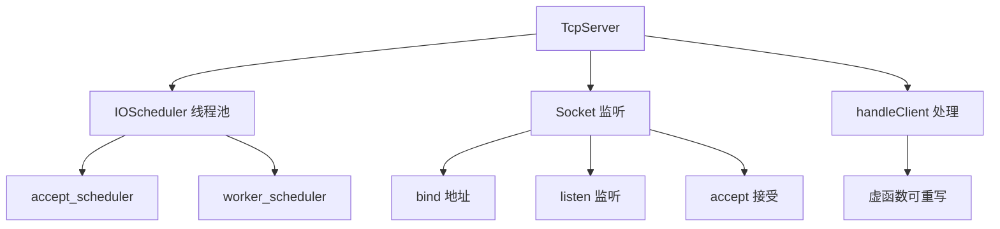

# LoNetfw 服务器基础模块架构设计

## 架构概览

```
Server 服务器基础模块
    │
    ├─ TcpServer（TCP 服务器基类）
    │    ├─ 监听 socket 管理
    │    ├─ 客户端连接处理
    │    ├─ SSL 支持
    │    └─ 超时管理
    │
    └─ ServerFactory（服务器工厂）
         └─ 创建和管理服务器实例
```



---

## 1. 什么是服务器基础模块？（通俗理解）

### 1.1 用生活例子理解服务器

想象一家餐厅：

| 角色 | 对应概念 | 作用 |
|------|---------|------|
| 餐厅门口 | TcpServer | 服务器入口 |
| 服务员团队 | IOScheduler | 线程池 |
| 点餐台 | accept | 接受连接 |
| 做菜 | handleClient | 处理请求 |
| 客户 | Socket | 客户端连接 |

**TcpServer 就是餐厅的"门口接待系统"。**

### 1.2 模块的作用

| 组件 | 作用 | 类比 |
|------|------|------|
| **TcpServer** | TCP 服务器基类 | 餐厅接待台 |
| **ServerFactory** | 服务器工厂 | 连锁餐厅管理 |

---

## 2. TcpServer 详解

### 2.1 TcpServer 的设计

```
TcpServer（TCP 服务器基类）
    │
    ├─ 属性
    │    ├─ m_scheduler（工作线程池）
    │    ├─ m_accept_scheduler（接受连接线程池）
    │    ├─ m_sockets（监听 socket 列表）
    │    ├─ m_client_timeout（客户端超时）
    │    └─ m_name（服务器名称）
    │
    ├─ 方法
    │    ├─ bind()（绑定地址）
    │    ├─ start()（启动服务器）
    │    ├─ stop()（停止服务器）
    │    └─ handleClient()（处理客户端 - 虚函数）
    │
    └─ 工作流程
         ├─ bind() → 绑定地址 + 监听
         ├─ start() → 开始接受连接
         ├─ startAccept() → 接受连接循环
         └─ handleClient() → 处理客户端请求
```

### 2.2 核心功能

**服务器生命周期**：

```cpp
// 1. 创建服务器
lon::server::TcpServer::Ptr server = std::make_shared<MyServer>(
    ios,              // 工作线程池
    accept_ios,       // 接受连接线程池（可以和 ios 相同）
    120000,           // 客户端超时（毫秒）
    "my_server"       // 服务器名称
);

// 2. 绑定地址
lon::net::Address::Ptr addr = lon::net::IPv4Address::create("0.0.0.0", 8080);
server->bind(addr);  // 绑定 + 监听

// 3. 启动服务器
server->start();

// 4. 停止服务器
server->stop();
```

**绑定地址**：

```cpp
// 绑定单个地址
lon::net::Address::Ptr addr1 = lon::net::IPv4Address::create("0.0.0.0", 8080);
server->bind(addr1);

// 绑定多个地址
std::vector<lon::net::Address::Ptr> addrs;
addrs.push_back(lon::net::IPv4Address::create("0.0.0.0", 8080));
addrs.push_back(lon::net::IPv4Address::create("0.0.0.0", 8081));

std::vector<lon::net::Address::Ptr> failed;
server->bind(addrs, failed);  // 失败的地址会存入 failed

// 绑定 SSL 地址
server->bind(addr, true);  // use_ssl = true
server->loadCertificates("server.crt", "server.key");
```

**设置属性**：

```cpp
// 设置客户端超时
server->setClientTimeout(60000);  // 60 秒

// 获取客户端超时
size_t timeout = server->getClientTimeout();

// 设置名称
server->setName("http_server");

// 获取名称
std::string name = server->getName();

// 检查是否停止
bool stopped = server->isStop();
```

### 2.3 处理客户端

**TcpServer 使用模板方法模式**：`handleClient()` 是虚函数，子类重写实现具体逻辑。

```cpp
class TcpServer {
protected:
    // 处理客户端连接（虚函数，子类重写）
    virtual void handleClient(const Socket::Ptr& client);
    
    // 接受连接循环
    virtual void startAccept(const Socket::Ptr& socket);
};
```

**默认实现**：

```cpp
// 默认 handleClient 实现（空实现）
void TcpServer::handleClient(const Socket::Ptr& client) {
    // 默认什么都不做
    // 子类应该重写这个方法
}

// accept 循环实现
void TcpServer::startAccept(const Socket::Ptr& socket) {
    while (!isStop()) {
        // 接受新连接
        Socket::Ptr client = socket->accept();
        if (client) {
            // 在工作线程池中处理
            m_scheduler->schedule([this, client]() {
                handleClient(client);
            });
        }
    }
}
```

### 2.4 自定义服务器

**继承 TcpServer 实现自定义服务器**：

```cpp
#include "server/tcpserver.h"

// 自定义 HTTP 服务器
class HttpServer : public lon::server::TcpServer {
public:
    HttpServer(
        lon::scheduler::IOScheduler* scheduler = lon::scheduler::IOScheduler::getThis(),
        lon::scheduler::IOScheduler* accept_scheduler = lon::scheduler::IOScheduler::getThis(),
        size_t client_timeout = 120000,
        const std::string& name = "http_server"
    ) : TcpServer(scheduler, accept_scheduler, client_timeout, name) {
    }
    
protected:
    // 重写 handleClient
    void handleClient(const lon::net::Socket::Ptr& client) override {
        // 处理 HTTP 请求
        while (true) {
            // 1. 接收请求
            char buf[4096];
            ssize_t n = client->recv(buf, sizeof(buf), 0);
            
            if (n <= 0) {
                break;  // 客户端断开
            }
            
            // 2. 解析请求
            std::string request(buf, n);
            
            // 3. 生成响应
            std::string response = "HTTP/1.1 200 OK\r\n"
                                   "Content-Type: text/plain\r\n"
                                   "Content-Length: 13\r\n"
                                   "\r\n"
                                   "Hello, World!";
            
            // 4. 发送响应
            client->send(response.c_str(), response.size(), 0);
        }
        
        client->close();
    }
};
```

---

## 3. ServerFactory 服务器工厂

### 3.1 ServerFactory 的作用

**ServerFactory = 创建和管理服务器实例的工厂类**

```
┌─────────────────────────────────────────────────┐
│              ServerFactory                       │
│                                                 │
│  创建服务器                                       │
│       ↓                                         │
│  管理服务器实例                                   │
│       ↓                                         │
│  统一启动/停止                                    │
└─────────────────────────────────────────────────┘
```

### 3.2 ServerFactory 使用示例

```cpp
#include "server/serverfactory.h"

void server_factory_example() {
    // 创建工厂
    lon::server::ServerFactory factory;
    
    // 创建多个服务器
    auto http_server = factory.create<HttpServer>("http_server", 8080);
    auto ws_server = factory.create<WebSocketServer>("ws_server", 8081);
    
    // 绑定地址
    http_server->bind(lon::net::IPv4Address::create("0.0.0.0", 8080));
    ws_server->bind(lon::net::IPv4Address::create("0.0.0.0", 8081));
    
    // 启动所有服务器
    factory.startAll();
    
    // 获取服务器
    auto server = factory.get("http_server");
    
    // 停止所有服务器
    factory.stopAll();
}
```

---

## 4. 使用示例（详细注释）

### 4.1 Echo 服务器

```cpp
#include "server/tcpserver.h"
#include "scheduler/ioscheduler.h"
#include "net/address.h"

// Echo 服务器：收到什么返回什么
class EchoServer : public lon::server::TcpServer {
public:
    EchoServer(
        lon::scheduler::IOScheduler* scheduler,
        lon::scheduler::IOScheduler* accept_scheduler,
        size_t client_timeout = 60000,
        const std::string& name = "echo_server"
    ) : TcpServer(scheduler, accept_scheduler, client_timeout, name) {
    }
    
protected:
    void handleClient(const lon::net::Socket::Ptr& client) override {
        std::cout << "新客户端: " << client->toString() << std::endl;
        
        char buf[1024];
        while (true) {
            // 接收数据
            ssize_t n = client->recv(buf, sizeof(buf), 0);
            
            if (n <= 0) {
                std::cout << "客户端断开" << std::endl;
                break;
            }
            
            // 发送回去（Echo）
            client->send(buf, n, 0);
        }
        
        client->close();
    }
};

int main() {
    // 创建 IO 调度器
    auto ios = std::make_shared<lon::scheduler::IOScheduler>(4, true, "echo");
    
    // 创建服务器
    auto server = std::make_shared<EchoServer>(ios.get(), ios.get());
    
    // 绑定地址
    auto addr = lon::net::IPv4Address::create("0.0.0.0", 8080);
    server->bind(addr);
    
    // 启动服务器
    server->start();
    
    std::cout << "Echo 服务器启动: " << addr->toString() << std::endl;
    
    return 0;
}
```

### 4.2 HTTP 服务器

```cpp
#include "server/tcpserver.h"
#include "scheduler/ioscheduler.h"
#include "net/address.h"

class HttpServer : public lon::server::TcpServer {
public:
    HttpServer(
        lon::scheduler::IOScheduler* scheduler,
        lon::scheduler::IOScheduler* accept_scheduler,
        const std::string& name = "http"
    ) : TcpServer(scheduler, accept_scheduler, 120000, name) {
    }
    
protected:
    void handleClient(const lon::net::Socket::Ptr& client) override {
        while (true) {
            // 接收请求
            char buf[4096];
            ssize_t n = client->recv(buf, sizeof(buf), 0);
            
            if (n <= 0) break;
            
            std::string request(buf, n);
            
            // 简单判断是否是 GET 请求
            if (request.find("GET ") == 0) {
                // 提取路径
                size_t start = request.find(' ') + 1;
                size_t end = request.find(' ', start);
                std::string path = request.substr(start, end - start);
                
                // 生成响应
                std::string body = "<html><body><h1>Hello from LoNetfw</h1>";
                body += "<p>Path: " + path + "</p>";
                body += "</body></html>";
                
                std::string response = "HTTP/1.1 200 OK\r\n";
                response += "Content-Type: text/html\r\n";
                response += "Content-Length: " + std::to_string(body.size()) + "\r\n";
                response += "Connection: close\r\n";
                response += "\r\n";
                response += body;
                
                client->send(response.c_str(), response.size(), 0);
                break;  // 简单 HTTP，发送后断开
            }
        }
        
        client->close();
    }
};

int main() {
    auto ios = std::make_shared<lon::scheduler::IOScheduler>(4, true, "http");
    auto server = std::make_shared<HttpServer>(ios.get(), ios.get());
    
    auto addr = lon::net::IPv4Address::create("0.0.0.0", 8080);
    server->bind(addr);
    server->start();
    
    std::cout << "HTTP 服务器启动: http://127.0.0.1:8080" << std::endl;
    
    return 0;
}
```

### 4.3 SSL/HTTPS 服务器

```cpp
#include "server/tcpserver.h"
#include "scheduler/ioscheduler.h"
#include "net/address.h"

class HttpsServer : public lon::server::TcpServer {
public:
    HttpsServer(
        lon::scheduler::IOScheduler* scheduler,
        lon::scheduler::IOScheduler* accept_scheduler
    ) : TcpServer(scheduler, accept_scheduler, 120000, "https") {
    }
    
protected:
    void handleClient(const lon::net::Socket::Ptr& client) override {
        // client 在 SSL 模式下是 SSLSocket
        // 处理逻辑和普通 HTTP 一样
        
        char buf[4096];
        ssize_t n = client->recv(buf, sizeof(buf), 0);
        
        if (n > 0) {
            std::string response = "HTTP/1.1 200 OK\r\n"
                                   "Content-Type: text/plain\r\n"
                                   "Content-Length: 10\r\n"
                                   "\r\n"
                                   "HTTPS OK!";
            client->send(response.c_str(), response.size(), 0);
        }
        
        client->close();
    }
};

int main() {
    auto ios = std::make_shared<lon::scheduler::IOScheduler>(4, true, "https");
    auto server = std::make_shared<HttpsServer>(ios.get(), ios.get());
    
    // 加载 SSL 证书
    server->loadCertificates("server.crt", "server.key");
    
    auto addr = lon::net::IPv4Address::create("0.0.0.0", 443);
    server->bind(addr, true);  // use_ssl = true
    server->start();
    
    std::cout << "HTTPS 服务器启动: https://127.0.0.1:443" << std::endl;
    
    return 0;
}
```

---

## 5. 配合 Application 使用

### 5.1 Application 集成

**TcpServer 通常配合 Application 使用**：

```cpp
#include "system/application.h"
#include "server/tcpserver.h"

// 自定义应用
class MyApp : public lon::system::Application {
public:
    bool init(int argc, char** argv) override {
        // 初始化应用
        if (!lon::system::Application::init(argc, argv)) {
            return false;
        }
        
        // 创建服务器
        auto http_server = std::make_shared<HttpServer>(
            lon::scheduler::IOScheduler::getThis(),
            lon::scheduler::IOScheduler::getThis()
        );
        
        // 绑定地址
        http_server->bind(lon::net::IPv4Address::create("0.0.0.0", 8080));
        
        // 注册服务器
        m_servers["http"].push_back(http_server);
        
        return true;
    }
    
    bool run() override {
        // 启动服务器
        for (auto& pair : m_servers) {
            for (auto& server : pair.second) {
                server->start();
            }
        }
        
        std::cout << "应用启动成功" << std::endl;
        
        return lon::system::Application::run();
    }
};

int main(int argc, char** argv) {
    MyApp app;
    app.init(argc, argv);
    app.run();
    
    return 0;
}
```

---

## 6. 常见问题解答

### Q1: accept_scheduler 和 scheduler 有什么区别？

| 对比项 | accept_scheduler | scheduler |
|--------|------------------|-----------|
| 作用 | 接受连接 | 处理请求 |
| 线程数 | 通常较少（1-2个） | 根据负载调整 |
| 阻塞时间 | 短（accept 很快） | 长（处理请求） |

**建议**：小服务器可以用同一个，大型服务器建议分开。

### Q2: m_client_timeout 有什么作用？

**客户端超时**：如果客户端在指定时间内没有发送数据，服务器会断开连接。

```cpp
// 设置超时 60 秒
server->setClientTimeout(60000);

// 如果客户端 60 秒内没有发送数据，连接会被断开
```

### Q3: 如何处理大量连接？

**建议**：

1. **增加线程数**：`IOScheduler(线程数, ...)`
2. **分离 accept 和 worker**：使用不同的 scheduler
3. **使用连接池**：重用连接资源

### Q4: handleClient 在哪个线程执行？

**handleClient 在 m_scheduler 的线程池中执行**：

```
accept_scheduler
    ↓
accept() 接受连接
    ↓
schedule(handleClient) 添加到 m_scheduler
    ↓
m_scheduler 的某个线程执行 handleClient
```

---

## 7. 总结

### TcpServer 的本质

**TcpServer = TCP 服务器的模板**

- 封装了 bind/listen/accept 循环
- 提供 handleClient 虚函数供扩展
- 支持多线程、超时、SSL

### TcpServer 的核心机制

| 机制 | 作用 |
|------|------|
| bind() | 绑定地址 + 监听 |
| start() | 开始接受连接 |
| startAccept() | accept 循环 |
| handleClient() | 处理客户端（虚函数） |

### TcpServer 的优势

1. **封装完善**：无需手动处理 accept 循环
2. **易于扩展**：继承重写 handleClient
3. **多线程支持**：配合 IOScheduler
4. **SSL 支持**：内置 SSL 功能
5. **超时管理**：自动断开超时连接

### 与其他模块的关系

```
TcpServer
    ↓
使用 IOScheduler（线程池）
    ↓
使用 Socket（网络通信）
    ↓
使用 Address（地址管理）

继承 TcpServer → 实现 HTTP/WebSocket 等具体服务器
```