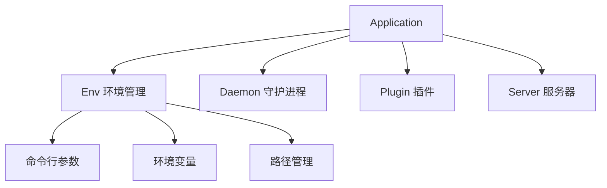

# LoNetfw 系统管理模块架构设计

## 架构概览

```
System 系统管理模块
    │
    ├─ Application（应用程序框架）
    │    ├─ 程序初始化
    │    ├─ 服务器管理
    │    └─ 运行循环
    │
    ├─ Env（环境管理）
    │    ├─ 命令行参数解析
    │    ├─ 环境变量管理
    │    └─ 路径管理
    │
    ├─ Daemon（守护进程）
    │    └─ 后台运行支持
    │
    └─ Plugin（插件系统）
         └─ 动态库加载
```



---

## 1. 什么是系统管理模块？（通俗理解）

### 1.1 用生活例子理解系统管理

想象你要开一家公司：

| 角色 | 对应概念 | 作用 |
|------|---------|------|
| 公司注册 | Application | 程序入口 |
| 公司地址 | Env | 环境管理 |
| 后台运营 | Daemon | 守护进程 |
| 外包团队 | Plugin | 插件系统 |

**系统管理模块就是程序的"基础设施"。**

### 1.2 模块的作用

| 模块 | 作用 | 类比 |
|------|------|------|
| **Application** | 程序框架 | 公司总部 |
| **Env** | 环境管理 | 公司地址 |
| **Daemon** | 守护进程 | 后台运营 |
| **Plugin** | 插件系统 | 外包团队 |

---

## 2. Application 应用程序框架

### 2.1 Application 的设计

```
Application（应用程序框架）
    │
    ├─ 属性
    │    ├─ m_argc / m_argv（命令行参数）
    │    ├─ m_servers（服务器列表）
    │    └─ m_main_ioscheduler（主调度器）
    │
    ├─ 方法
    │    ├─ init()（初始化）
    │    ├─ run()（运行）
    │    └─ getServer()（获取服务器）
    │
    └─ 使用方式
         ├─ 单例模式
         └─ 继承重写
```

### 2.2 Application 核心功能

**程序入口**：

```cpp
#include "system/application.h"

int main(int argc, char** argv) {
    // 获取单例
    lon::system::Application& app = lon::system::Application::Instance();
    
    // 初始化
    if (!app.init(argc, argv)) {
        std::cerr << "初始化失败" << std::endl;
        return -1;
    }
    
    // 运行
    if (!app.run()) {
        std::cerr << "运行失败" << std::endl;
        return -1;
    }
    
    return 0;
}
```

**服务器管理**：

```cpp
// 获取服务器
std::vector<lon::server::TcpServer::Ptr> servers;
app.getServer("http", servers);

for (auto& server : servers) {
    std::cout << "服务器: " << server->getName() << std::endl;
}
```

### 2.3 自定义 Application

```cpp
#include "system/application.h"
#include "server/tcpserver.h"

// 自定义应用
class MyApplication : public lon::system::Application {
public:
    static MyApplication& Instance() {
        static MyApplication instance;
        return instance;
    }
    
    bool init(int argc, char** argv) override {
        // 调用父类初始化
        if (!Application::init(argc, argv)) {
            return false;
        }
        
        // 自定义初始化
        std::cout << "自定义初始化..." << std::endl;
        
        // 创建服务器
        auto http_server = std::make_shared<MyHttpServer>();
        http_server->bind(lon::net::IPv4Address::create("0.0.0.0", 8080));
        
        // 注册服务器
        m_servers["http"].push_back(http_server);
        
        return true;
    }
    
    bool run() override {
        // 启动服务器
        for (auto& pair : m_servers) {
            for (auto& server : pair.second) {
                server->start();
            }
        }
        
        std::cout << "应用启动成功" << std::endl;
        
        // 调用父类 run
        return Application::run();
    }
};

int main(int argc, char** argv) {
    MyApplication& app = MyApplication::Instance();
    
    if (!app.init(argc, argv)) {
        return -1;
    }
    
    return app.run() ? 0 : -1;
}
```

---

## 3. Env 环境管理

### 3.1 Env 的作用

**Env = 管理程序运行环境**

```
┌─────────────────────────────────────────────────┐
│              Env 环境管理                        │
│                                                 │
│  命令行参数                                      │
│       ├─ 解析参数                                │
│       └─ 提供访问接口                            │
│                                                 │
│  环境变量                                        │
│       ├─ 获取环境变量                            │
│       └─ 设置环境变量                            │
│                                                 │
│  路径管理                                        │
│       ├─ 可执行文件路径                          │
│       ├─ 当前工作目录                            │
│       └─ 配置文件路径                            │
└─────────────────────────────────────────────────┘
```

### 3.2 Env 核心功能

**命令行参数**：

```cpp
#include "system/env.h"

int main(int argc, char** argv) {
    // 初始化环境
    ENVMGR.init(argc, argv);
    
    // 获取程序名
    std::string program = ENVMGR.getProgram();
    std::cout << "程序: " << program << std::endl;
    
    // 获取可执行文件路径
    std::string exe = ENVMGR.getExe();
    std::cout << "可执行文件: " << exe << std::endl;
    
    // 获取当前工作目录
    std::string cwd = ENVMGR.getCwd();
    std::cout << "工作目录: " << cwd << std::endl;
    
    // 添加参数定义
    ENVMGR.addArgument("port,p", "服务端口");
    ENVMGR.addArgument("config,c", "配置文件路径");
    ENVMGR.addArgument({"verbose,v"}, "详细输出");
    
    // 获取参数值
    int port = ENVMGR.get<int>("port");
    std::string config = ENVMGR.get<std::string>("config");
    bool verbose = ENVMGR.get<bool>("verbose");
    
    std::cout << "端口: " << port << std::endl;
    std::cout << "配置: " << config << std::endl;
    std::cout << "详细: " << verbose << std::endl;
    
    return 0;
}
```

**环境变量**：

```cpp
// 获取环境变量
std::string path = ENVMGR.getEnv("PATH", "/usr/bin");
std::string home = ENVMGR.getEnv("HOME", "/home/user");

std::cout << "PATH: " << path << std::endl;
std::cout << "HOME: " << home << std::endl;

// 设置环境变量
ENVMGR.setEnv("MY_VAR", "my_value");
```

**路径管理**：

```cpp
// 获取绝对路径
std::string abs_path = ENVMGR.getAbsolutePath("config.yaml");
std::cout << "绝对路径: " << abs_path << std::endl;

// 获取配置文件路径
std::string config_path = ENVMGR.getConfigPath();
std::cout << "配置路径: " << config_path << std::endl;

// 获取插件路径
std::string plugin_path = ENVMGR.getPluginPath();
std::cout << "插件路径: " << plugin_path << std::endl;
```

### 3.3 Env 使用示例

```cpp
#include "system/env.h"
#include "log/logger.h"

static auto g_logger = LON_LOG_ROOT;

void env_example() {
    // 获取程序信息
    LON_INFO(g_logger) << "程序: " << ENVMGR.getProgram();
    LON_INFO(g_logger) << "路径: " << ENVMGR.getExe();
    LON_INFO(g_logger) << "工作目录: " << ENVMGR.getCwd();
    
    // 添加参数
    ENVMGR.addArgument("port,p", "服务端口，默认 8080");
    ENVMGR.addArgument("host,h", "服务地址，默认 0.0.0.0");
    ENVMGR.addArgument({"daemon,d"}, "以守护进程运行");
    ENVMGR.addArgument({"verbose,v"}, "详细输出");
    
    // 获取参数
    int port = ENVMGR.get<int>("port");
    std::string host = ENVMGR.get<std::string>("host");
    bool daemon = ENVMGR.get<bool>("daemon");
    bool verbose = ENVMGR.get<bool>("verbose");
    
    LON_INFO(g_logger) << "端口: " << port;
    LON_INFO(g_logger) << "地址: " << host;
    LON_INFO(g_logger) << "守护进程: " << daemon;
    LON_INFO(g_logger) << "详细输出: " << verbose;
    
    // 获取环境变量
    std::string path = ENVMGR.getEnv("PATH");
    LON_INFO(g_logger) << "PATH: " << path;
    
    // 获取配置路径
    std::string config = ENVMGR.getConfigPath();
    LON_INFO(g_logger) << "配置路径: " << config;
}

int main(int argc, char** argv) {
    ENVMGR.init(argc, argv);
    env_example();
    return 0;
}
```

---

## 4. Daemon 守护进程

### 4.1 Daemon 的作用

**Daemon = 让程序在后台运行（守护进程）**

```
┌─────────────────────────────────────────────────┐
│              Daemon 守护进程                     │
│                                                 │
│  前台运行                                        │
│       ├─ 终端关闭后程序退出                       │
│       └─ 输出到终端                              │
│                                                 │
│  后台运行（守护进程）                             │
│       ├─ 终端关闭后程序继续运行                   │
│       ├─ 输出到日志文件                          │
│       └─ 脱离终端会话                            │
└─────────────────────────────────────────────────┘
```

### 4.2 Daemon 使用示例

```cpp
#include "system/daemon.h"
#include "system/application.h"

int main(int argc, char** argv) {
    // 初始化环境
    ENVMGR.init(argc, argv);
    
    // 检查是否以守护进程运行
    bool daemon = ENVMGR.get<bool>("daemon");
    
    if (daemon) {
        // 启动守护进程
        if (!lon::system::Daemon::start()) {
            std::cerr << "启动守护进程失败" << std::endl;
            return -1;
        }
        // 此后程序在后台运行，输出重定向到日志文件
    }
    
    // 运行应用
    lon::system::Application& app = lon::system::Application::Instance();
    app.init(argc, argv);
    app.run();
    
    return 0;
}
```

### 4.3 Daemon 实现原理

```cpp
// Linux 守护进程实现
bool Daemon::start() {
    // 1. 创建子进程
    pid_t pid = fork();
    if (pid < 0) return false;
    
    // 2. 父进程退出
    if (pid > 0) exit(0);
    
    // 3. 创建新会话
    setsid();
    
    // 4. 再次 fork（防止获取终端）
    pid = fork();
    if (pid < 0) return false;
    if (pid > 0) exit(0);
    
    // 5. 切换工作目录
    chdir("/");
    
    // 6. 重设文件权限
    umask(0);
    
    // 7. 关闭标准输入输出
    close(STDIN_FILENO);
    close(STDOUT_FILENO);
    close(STDERR_FILENO);
    
    // 8. 重定向到日志文件
    int fd = open("/var/log/myapp.log", O_RDWR | O_CREAT | O_APPEND, 0644);
    dup2(fd, STDOUT_FILENO);
    dup2(fd, STDERR_FILENO);
    
    return true;
}
```

---

## 5. Plugin 插件系统

### 5.1 Plugin 的作用

**Plugin = 动态加载共享库（.so/.dll），实现功能扩展**

```
┌─────────────────────────────────────────────────┐
│              Plugin 插件系统                     │
│                                                 │
│  主程序                                          │
│       ↓                                         │
│  加载插件（动态库）                               │
│       ↓                                         │
│  调用插件接口                                    │
│       ↓                                         │
│  实现功能扩展                                    │
└─────────────────────────────────────────────────┘
```

### 5.2 Plugin 使用示例

```cpp
#include "system/plugin.h"

// 定义插件接口
class IMyPlugin {
public:
    virtual ~IMyPlugin() = default;
    virtual std::string getName() = 0;
    virtual void execute() = 0;
};

// 插件工厂函数类型
typedef IMyPlugin* (*CreatePluginFunc)();

void plugin_example() {
    // 加载插件
    lon::system::Plugin plugin("my_plugin.dll");  // Windows
    // lon::system::Plugin plugin("my_plugin.so"); // Linux
    
    if (!plugin.isLoaded()) {
        std::cerr << "加载插件失败: " << plugin.getErrorString() << std::endl;
        return;
    }
    
    // 获取工厂函数
    auto createFunc = plugin.getSymbol<CreatePluginFunc>("createPlugin");
    if (!createFunc) {
        std::cerr << "获取工厂函数失败" << std::endl;
        return;
    }
    
    // 创建插件实例
    IMyPlugin* myPlugin = createFunc();
    if (!myPlugin) {
        std::cerr << "创建插件实例失败" << std::endl;
        return;
    }
    
    // 使用插件
    std::cout << "插件名称: " << myPlugin->getName() << std::endl;
    myPlugin->execute();
    
    // 清理
    delete myPlugin;
    plugin.unload();
}
```

### 5.3 编写插件

```cpp
// my_plugin.cpp（编译为 my_plugin.dll/.so）

#include "my_plugin.h"

class MyPlugin : public IMyPlugin {
public:
    std::string getName() override {
        return "MyPlugin";
    }
    
    void execute() override {
        std::cout << "插件执行中..." << std::endl;
    }
};

// 导出工厂函数
extern "C" {
    IMyPlugin* createPlugin() {
        return new MyPlugin();
    }
    
    void destroyPlugin(IMyPlugin* plugin) {
        delete plugin;
    }
}
```

---

## 6. 完整应用示例

### 6.1 标准应用结构

```cpp
// main.cpp
#include "lonetfw/lonetfw.h"

static auto g_logger = LON_LOG_ROOT;

class MyApplication : public lon::system::Application {
public:
    static MyApplication& Instance() {
        static MyApplication instance;
        return instance;
    }
    
    bool init(int argc, char** argv) override {
        // 初始化环境
        ENVMGR.init(argc, argv);
        
        // 添加命令行参数
        ENVMGR.addArgument("port,p", "服务端口");
        ENVMGR.addArgument({"daemon,d"}, "守护进程模式");
        ENVMGR.addArgument("config,c", "配置文件路径");
        
        // 获取参数
        int port = ENVMGR.get<int>("port");
        bool daemon = ENVMGR.get<bool>("daemon");
        std::string config = ENVMGR.get<std::string>("config");
        
        LON_INFO(g_logger) << "端口: " << port;
        LON_INFO(g_logger) << "守护进程: " << daemon;
        LON_INFO(g_logger) << "配置文件: " << config;
        
        // 启动守护进程
        if (daemon) {
            if (!lon::system::Daemon::start()) {
                LON_ERROR(g_logger) << "启动守护进程失败";
                return false;
            }
            LON_INFO(g_logger) << "守护进程已启动";
        }
        
        // 加载配置
        lon::config::Config::parseFromYaml(config);
        
        // 创建 IO 调度器
        m_main_ioscheduler = std::make_shared<lon::scheduler::IOScheduler>(4, true, "main");
        
        // 创建服务器
        auto http_server = std::make_shared<MyHttpServer>();
        http_server->bind(lon::net::IPv4Address::create("0.0.0.0", port));
        
        m_servers["http"].push_back(http_server);
        
        return Application::init(argc, argv);
    }
    
    bool run() override {
        // 启动服务器
        for (auto& pair : m_servers) {
            for (auto& server : pair.second) {
                server->start();
            }
        }
        
        LON_INFO(g_logger) << "应用启动成功";
        
        return Application::run();
    }
};

int main(int argc, char** argv) {
    return MyApplication::Instance().init(argc, argv) && 
           MyApplication::Instance().run() ? 0 : -1;
}
```

---

## 7. 常见问题解答

### Q1: Application 和 main 函数有什么区别？

| 对比项 | main 函数 | Application |
|--------|----------|------------|
| 作用 | 程序入口 | 程序框架 |
| 功能 | 简单 | 完整（初始化、运行、管理） |
| 生命周期 | 一次性 | 可扩展 |

**比喻**：
- main = 房子的门
- Application = 房子的整体结构

### Q2: Env 和环境变量有什么区别？

| 对比项 | 环境变量 | Env |
|--------|---------|-----|
| 来源 | 操作系统 | 程序内部 |
| 用途 | 系统配置 | 程序配置 |
| 管理 | 手动 | 自动 |

**Env 提供了统一的配置管理接口。**

### Q3: 什么时候需要守护进程？

| 场景 | 是否需要 |
|------|---------|
| 开发调试 | 不需要 |
| 生产环境服务器 | 需要 |
| 临时运行的工具 | 不需要 |
| 后台服务 | 需要 |

### Q4: Plugin 和静态链接有什么区别？

| 对比项 | 静态链接 | Plugin |
|--------|---------|--------|
| 加载时机 | 编译时 | 运行时 |
| 更新方式 | 重新编译 | 替换插件 |
| 灵活性 | 低 | 高 |

---

## 8. 总结

### 系统管理模块的本质

**系统管理模块 = 程序的"基础设施"**

- Application：程序框架
- Env：环境管理
- Daemon：守护进程
- Plugin：插件系统

### 各模块的关系

```
Application（程序框架）
    ├─ Env（环境管理）
    │    ├─ 命令行参数
    │    └─ 环境变量
    ├─ Daemon（守护进程）
    │    └─ 后台运行
    ├─ Plugin（插件系统）
    │    └─ 动态加载
    └─ Server（服务器）
         └─ IOScheduler
```

### 模块的优势

1. **统一框架**：Application 提供标准程序结构
2. **灵活配置**：Env 支持命令行和环境变量
3. **后台支持**：Daemon 支持守护进程模式
4. **可扩展**：Plugin 支持动态加载功能

### 与其他模块的关系

```
System（系统管理）
    ↓
管理整个程序生命周期
    ↓
使用 Config（配置）、Log（日志）、Scheduler（调度器）
    ↓
创建 Server（服务器）处理请求
```