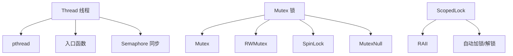

# LoNetfw 线程与同步模块架构设计

## 架构概览

```
Thread 线程与同步模块
    │
    ├─ Thread（线程封装）
    │    ├─ 线程创建与管理
    │    ├─ 线程名称/ID
    │    └─ 线程入口函数
    │
    ├─ Mutex（互斥锁）
    │    ├─ Mutex（普通互斥锁）
    │    ├─ RWMutex（读写锁）
    │    ├─ SpinLock（自旋锁）
    │    └─ MutexNull（空锁，用于模板编程）
    │
    ├─ Semaphore（信号量）
    │    ├─ wait()（等待）
    │    └─ notify()（通知）
    │
    └─ ScopedLock（RAII 锁管理）
         ├─ ScopedLock（普通锁）
         ├─ ScopedRdLock（读锁）
         └─ ScopedWrLock（写锁）
```



---

## 1. 什么是线程与同步模块？（通俗理解）

### 1.1 用生活例子理解线程同步

想象一个银行柜台：

| 场景 | 无同步 | 有同步 |
|------|--------|--------|
| 多人同时取钱 | 可能出错 | 一个一个处理 |
| 查看余额 | 可能读到脏数据 | 读到正确数据 |
| 存钱和取钱同时进行 | 数据不一致 | 保证一致性 |

**线程同步就是让多个线程"有序"访问共享资源。**

### 1.2 模块的作用

| 组件 | 作用 | 类比 |
|------|------|------|
| **Thread** | 线程管理 | 餐厅服务员 |
| **Mutex** | 互斥锁 | 单人通道 |
| **RWMutex** | 读写锁 | 多人看，一人写 |
| **SpinLock** | 自旋锁 | 快速通道 |
| **Semaphore** | 信号量 | 售票窗口 |
| **ScopedLock** | RAII 锁管理 | 自动门禁 |

---

## 2. Thread 线程类详解

### 2.1 Thread 的设计

```
Thread（线程封装）
    │
    ├─ 属性
    │    ├─ m_id（线程ID）
    │    ├─ m_thread（pthread_t）
    │    ├─ m_cb（入口函数）
    │    ├─ m_name（线程名）
    │    └─ m_semaphore（同步信号量）
    │
    ├─ 方法
    │    ├─ getId() / setId()
    │    ├─ getName() / setName()
    │    ├─ join()（等待线程结束）
    │    ├─ getThis()（获取当前线程）
    │    └─ 静态方法（获取/设置当前线程信息）
    │
    └─ 工作流程
         ├─ 构造：创建 pthread 线程
         ├─ run()：线程入口函数
         ├─ 执行用户回调
         └─ 析构：join 等待结束
```

### 2.2 Thread 核心功能

**线程创建与管理**：

```cpp
class Thread : public util::Nonecopyable {
public:
    using Ptr = std::shared_ptr<Thread>;
    
    // 构造函数：创建线程
    Thread(std::function<void()> cb, const std::string& name = "UNKNOWN");
    
    // 析构函数：等待线程结束
    virtual ~Thread();
    
    // 获取线程信息
    pid_t getId() const;
    std::string getName() const;
    
    // 设置线程信息
    void setId(const pid_t& id);
    void setName(const std::string& name);
    
    // 等待线程结束
    void join();
    
    // 获取当前线程（静态方法）
    static Thread* getThis();
    static const std::string& getNameStatic();
    static void setNameStatic(const std::string& name);
    static const pid_t getIdStatic();
    
private:
    // 线程入口函数
    static void* run(void* arg);
    
private:
    pid_t m_id;                // 线程ID
    pthread_t m_thread;        // pthread 线程
    std::function<void()> m_cb; // 入口函数
    std::string m_name;        // 线程名
    Semaphore m_semaphore;     // 同步信号量
};
```

### 2.3 Thread 使用示例

```cpp
#include "thread/thread.h"

void thread_example() {
    // 创建线程
    lon::thread::Thread::Ptr thread = std::make_shared<lon::thread::Thread>(
        []() {
            std::cout << "线程ID: " << lon::thread::Thread::getIdStatic() << std::endl;
            std::cout << "线程名: " << lon::thread::Thread::getNameStatic() << std::endl;
            
            // 执行一些任务
            for (int i = 0; i < 10; ++i) {
                std::cout << "任务: " << i << std::endl;
            }
        },
        "worker_thread"
    );
    
    std::cout << "主线程ID: " << thread->getId() << std::endl;
    std::cout << "主线程名: " << thread->getName() << std::endl;
    
    // 等待线程结束
    thread->join();
    
    std::cout << "线程执行完成" << std::endl;
}
```

### 2.4 Thread 实现原理

```cpp
// 构造函数
Thread::Thread(std::function<void()> cb, const std::string& name)
    : m_cb(cb), m_name(name) {
    // 创建 pthread 线程
    int ret = pthread_create(&m_thread, nullptr, &Thread::run, this);
    if (ret) {
        throw std::logic_error("pthread_create failed");
    }
    
    // 等待线程启动（使用信号量）
    m_semaphore.wait();
}

// 线程入口函数
void* Thread::run(void* arg) {
    Thread* thread = static_cast<Thread*>(arg);
    
    // 设置线程局部存储（用于 getThis）
    t_thread = thread;
    
    // 通知构造函数线程已启动
    thread->m_semaphore.notify();
    
    // 执行用户回调
    thread->m_cb();
    
    return nullptr;
}

// 析构函数
Thread::~Thread() {
    // 等待线程结束
    if (m_thread) {
        pthread_detach(m_thread);
    }
}
```

---

## 3. Mutex 互斥锁详解

### 3.1 Mutex 类型对比

| 类型 | 特点 | 适用场景 |
|------|------|---------|
| **Mutex** | 普通互斥锁 | 一般场景 |
| **RWMutex** | 读写锁 | 读多写少 |
| **SpinLock** | 自旋锁 | 短时间锁定 |
| **MutexNull** | 空锁 | 模板编程 |

### 3.2 Mutex（普通互斥锁）

**Mutex 提供基本的互斥功能**：

```cpp
class Mutex : public util::Nonecopyable {
public:
    using Lock = ScopedLock<Mutex>;
    
    Mutex();
    virtual ~Mutex();
    
    void lock();   // 加锁
    void unlock(); // 解锁
    
private:
    mutable pthread_mutex_t m_lock;
};
```

**使用示例**：

```cpp
#include "thread/mutex.h"

lon::thread::Mutex mutex;

void mutex_example() {
    // 手动加锁/解锁
    mutex.lock();
    // 临界区操作
    std::cout << "在临界区内" << std::endl;
    mutex.unlock();
    
    // 使用 RAII 风格（推荐）
    {
        lon::thread::Mutex::Lock lock(mutex);  // 自动加锁
        // 临界区操作
        std::cout << "在临界区内" << std::endl;
    }  // 自动解锁（离开作用域）
}
```

### 3.3 RWMutex（读写锁）

**RWMutex 允许多读单写**：

```cpp
class RWMutex : public util::Nonecopyable {
public:
    using RdLock = ScopedRdLock<RWMutex>;
    using WrLock = ScopedWrLock<RWMutex>;
    
    RWMutex();
    virtual ~RWMutex();
    
    void rdlock(); // 读锁（共享）
    void wrlock(); // 写锁（独占）
    void unlock(); // 解锁
    
private:
    mutable pthread_rwlock_t m_lock;
};
```

**读写锁的特点**：

| 操作 | 读锁 | 写锁 |
|------|------|------|
| 多个读锁 | ✓ 允许 | ✗ 不允许 |
| 读锁 + 写锁 | ✗ 不允许 | ✗ 不允许 |
| 多个写锁 | ✗ 不允许 | ✗ 不允许 |

**使用示例**：

```cpp
#include "thread/mutex.h"

lon::thread::RWMutex rwmutex;

int shared_data = 0;

void read_data() {
    // 读锁：允许多个线程同时读
    lon::thread::RWMutex::RdLock lock(rwmutex);
    std::cout << "读取数据: " << shared_data << std::endl;
}

void write_data(int value) {
    // 写锁：只有一个线程可以写
    lon::thread::RWMutex::WrLock lock(rwmutex);
    shared_data = value;
    std::cout << "写入数据: " << shared_data << std::endl;
}
```

### 3.4 SpinLock（自旋锁）

**SpinLock 在等待时不会让出 CPU**：

```cpp
class SpinLock : public util::Nonecopyable {
public:
    using Lock = ScopedLock<SpinLock>;
    
    SpinLock();
    virtual ~SpinLock();
    
    void lock();   // 加锁（自旋等待）
    void unlock(); // 解锁
    
private:
    mutable pthread_spinlock_t m_lock;
};
```

**自旋锁 vs 互斥锁**：

| 对比项 | Mutex | SpinLock |
|--------|-------|----------|
| 等待方式 | 让出 CPU（睡眠） | 自旋等待（不睡眠） |
| 适用场景 | 锁定时间长 | 锁定时间短 |
| CPU 使用 | 低 | 高（等待时占用） |

**使用示例**：

```cpp
#include "thread/mutex.h"

lon::thread::SpinLock spinlock;

void spinlock_example() {
    // 自旋锁适合短时间锁定
    lon::thread::SpinLock::Lock lock(spinlock);
    // 快速操作
    int temp = 0;
    temp++;
}
```

### 3.5 MutexNull（空锁）

**MutexNull 用于模板编程**：

```cpp
class MutexNull : public util::Nonecopyable {
public:
    using Lock = ScopedLock<MutexNull>;
    
    MutexNull() = default;
    virtual ~MutexNull() = default;
    
    void lock() {}   // 空操作
    void unlock() {} // 空操作
};
```

**用途**：在单线程环境下，避免锁开销。

```cpp
// 模板参数可以是 Mutex 或 MutexNull
template<typename MutexType>
class ThreadSafeContainer {
public:
    void operation() {
        MutexType::Lock lock(m_mutex);
        // 操作
    }
private:
    MutexType m_mutex;
};

// 多线程环境：使用真实锁
ThreadSafeContainer<lon::thread::Mutex> container1;

// 单线程环境：使用空锁（避免开销）
ThreadSafeContainer<lon::thread::MutexNull> container2;
```

---

## 4. Semaphore 信号量详解

### 4.1 Semaphore 的设计

**Semaphore 控制并发数量**：

```cpp
class Semaphore : public util::Nonecopyable {
public:
    explicit Semaphore(uint32_t count = 0);
    virtual ~Semaphore();
    
    void wait();   // 等待（减少计数）
    void notify(); // 通知（增加计数）
    
private:
    sem_t m_semaphore;
    uint32_t m_count;
};
```

### 4.2 Semaphore 使用示例

```cpp
#include "thread/semaphore.h"

lon::thread::Semaphore sem(3);  // 允许3个并发

void semaphore_example() {
    // 等待获取许可
    sem.wait();  // 如果计数为0，阻塞等待
    
    // 执行任务
    std::cout << "执行任务" << std::endl;
    
    // 释放许可
    sem.notify();
}

// 控制并发数量
void limited_concurrent_tasks() {
    lon::thread::Semaphore sem(5);  // 最多5个并发
    
    // 创建10个线程
    for (int i = 0; i < 10; ++i) {
        lon::thread::Thread::Ptr thread = std::make_shared<lon::thread::Thread>(
            [&sem, i]() {
                sem.wait();  // 等待许可
                std::cout << "任务 " << i << " 开始" << std::endl;
                // 执行任务
                std::cout << "任务 " << i << " 完成" << std::endl;
                sem.notify();  // 释放许可
            },
            "task_" + std::to_string(i)
        );
        thread->join();
    }
}
```

---

## 5. ScopedLock RAII 锁管理详解

### 5.1 ScopedLock 的设计

**ScopedLock 自动管理锁的生命周期**：

```cpp
template<typename T>
class ScopedLock : public util::Nonecopyable {
public:
    explicit ScopedLock(T& mutex) : m_mutex(mutex), m_locked(false) {
        lock();  // 构造时自动加锁
    }
    
    virtual ~ScopedLock() {
        unlock();  // 析构时自动解锁
    }
    
    void lock() {
        if (!m_locked) {
            m_mutex.lock();
            m_locked = true;
        }
    }
    
    void unlock() {
        if (m_locked) {
            m_mutex.unlock();
            m_locked = false;
        }
    }
    
private:
    T& m_mutex;
    bool m_locked;
};
```

### 5.2 ScopedLock 的优势

| 对比项 | 手动加锁 | ScopedLock |
|--------|---------|------------|
| 异常安全 | 可能死锁 | 自动解锁 |
| 代码简洁 | 需要手动解锁 | 自动管理 |
| 忘记解锁 | 会死锁 | 不可能忘记 |

### 5.3 ScopedLock 使用示例

```cpp
#include "thread/mutex.h"

lon::thread::Mutex mutex;

void scoped_lock_example() {
    // 方式1：手动加锁（危险）
    mutex.lock();
    try {
        // 操作可能抛出异常
        throw std::runtime_error("error");
        mutex.unlock();  // 这里不会执行，导致死锁！
    } catch (...) {
        mutex.unlock();  // 需要在 catch 中解锁
    }
    
    // 方式2：RAII 风格（安全）
    {
        lon::thread::Mutex::Lock lock(mutex);  // 自动加锁
        try {
            throw std::runtime_error("error");
        } catch (...) {
            // 异常会被捕获，离开作用域时自动解锁
        }
    }  // 自动解锁（离开作用域）
}
```

### 5.4 ScopedRdLock / ScopedWrLock

```cpp
#include "thread/mutex.h"

lon::thread::RWMutex rwmutex;

void scoped_rwlock_example() {
    // 读锁
    {
        lon::thread::RWMutex::RdLock lock(rwmutex);  // 自动读锁
        std::cout << "读取数据" << std::endl;
    }  // 自动解锁
    
    // 写锁
    {
        lon::thread::RWMutex::WrLock lock(rwmutex);  // 自动写锁
        std::cout << "写入数据" << std::endl;
    }  // 自动解锁
}
```

---

## 6. 完整使用示例

### 6.1 线程安全的计数器

```cpp
#include "thread/thread.h"
#include "thread/mutex.h"
#include <atomic>

class ThreadSafeCounter {
public:
    ThreadSafeCounter() : m_count(0) {}
    
    void increment() {
        lon::thread::Mutex::Lock lock(m_mutex);
        m_count++;
    }
    
    void decrement() {
        lon::thread::Mutex::Lock lock(m_mutex);
        m_count--;
    }
    
    int get() {
        lon::thread::Mutex::Lock lock(m_mutex);
        return m_count;
    }
    
private:
    int m_count;
    lon::thread::Mutex m_mutex;
};

void counter_example() {
    ThreadSafeCounter counter;
    
    // 创建多个线程并发操作计数器
    std::vector<lon::thread::Thread::Ptr> threads;
    for (int i = 0; i < 10; ++i) {
        threads.push_back(std::make_shared<lon::thread::Thread>(
            [&counter]() {
                for (int j = 0; j < 1000; ++j) {
                    counter.increment();
                }
            },
            "counter_thread_" + std::to_string(i)
        ));
    }
    
    // 等待所有线程结束
    for (auto& thread : threads) {
        thread->join();
    }
    
    std::cout << "最终计数: " << counter.get() << std::endl;  // 10000
}
```

### 6.2 线程安全的队列

```cpp
#include "thread/mutex.h"
#include <queue>

template<typename T>
class ThreadSafeQueue {
public:
    void push(const T& value) {
        lon::thread::Mutex::Lock lock(m_mutex);
        m_queue.push(value);
    }
    
    bool pop(T& value) {
        lon::thread::Mutex::Lock lock(m_mutex);
        if (m_queue.empty()) {
            return false;
        }
        value = m_queue.front();
        m_queue.pop();
        return true;
    }
    
    bool empty() {
        lon::thread::Mutex::Lock lock(m_mutex);
        return m_queue.empty();
    }
    
    size_t size() {
        lon::thread::Mutex::Lock lock(m_mutex);
        return m_queue.size();
    }
    
private:
    std::queue<T> m_queue;
    lon::thread::Mutex m_mutex;
};

void queue_example() {
    ThreadSafeQueue<int> queue;
    
    // 生产者线程
    lon::thread::Thread::Ptr producer = std::make_shared<lon::thread::Thread>(
        [&queue]() {
            for (int i = 0; i < 100; ++i) {
                queue.push(i);
            }
        },
        "producer"
    );
    
    // 消费者线程
    lon::thread::Thread::Ptr consumer = std::make_shared<lon::thread::Thread>(
        [&queue]() {
            int value;
            while (queue.pop(value)) {
                std::cout << "消费: " << value << std::endl;
            }
        },
        "consumer"
    );
    
    producer->join();
    consumer->join();
}
```

### 6.3 使用读写锁的缓存

```cpp
#include "thread/mutex.h"
#include <map>

template<typename K, typename V>
class ThreadSafeCache {
public:
    V get(const K& key) {
        lon::thread::RWMutex::RdLock lock(m_mutex);
        auto it = m_cache.find(key);
        if (it != m_cache.end()) {
            return it->second;
        }
        return V();  // 返回默认值
    }
    
    void set(const K& key, const V& value) {
        lon::thread::RWMutex::WrLock lock(m_mutex);
        m_cache[key] = value;
    }
    
    bool contains(const K& key) {
        lon::thread::RWMutex::RdLock lock(m_mutex);
        return m_cache.find(key) != m_cache.end();
    }
    
    void remove(const K& key) {
        lon::thread::RWMutex::WrLock lock(m_mutex);
        m_cache.erase(key);
    }
    
private:
    std::map<K, V> m_cache;
    lon::thread::RWMutex m_mutex;
};
```

---

## 7. 常见问题解答

### Q1: Mutex 和 RWMutex 有什么区别？

| 对比项 | Mutex | RWMutex |
|--------|-------|---------|
| 读操作 | 独占 | 共享 |
| 写操作 | 独占 | 独占 |
| 适用场景 | 一般 | 读多写少 |
| 性能 | 读时互斥 | 读时可并发 |

### Q2: SpinLock 和 Mutex 有什么区别？

| 对比项 | Mutex | SpinLock |
|--------|-------|----------|
| 等待方式 | 睡眠等待 | 自旋等待 |
| CPU 使用 | 低 | 高 |
| 适用场景 | 长时间锁定 | 短时间锁定 |

### Q3: 为什么需要 ScopedLock？

**原因**：确保异常安全。

```cpp
// 没有 ScopedLock：异常时可能死锁
mutex.lock();
throw_exception();  // 抛出异常，mutex.unlock() 不执行
mutex.unlock();

// 有 ScopedLock：异常时自动解锁
{
    Mutex::Lock lock(mutex);  // 构造时加锁
    throw_exception();  // 抛出异常
}  // 析构时自动解锁（即使抛出异常）
```

### Q4: Semaphore 和 Mutex 有什么区别？

| 对比项 | Mutex | Semaphore |
|--------|-------|----------|
| 功能 | 二值（0/1） | 多值（计数） |
| 用途 | 互斥 | 控制并发数量 |
| 比喻 | 单人通道 | 售票窗口 |

---

## 8. 总结

### 线程与同步模块的本质

**线程与同步模块 = 多线程编程的"基础设施"**

- Thread：线程管理
- Mutex/RWMutex/SpinLock：互斥机制
- Semaphore：信号量
- ScopedLock：RAII 锁管理

### 各组件的关系

```
Thread（线程）
    ↓
访问共享资源
    ↓
需要同步保护
    ├─ Mutex（互斥锁）
    ├─ RWMutex（读写锁）
    ├─ SpinLock（自旋锁）
    └─ Semaphore（信号量）
    ↓
使用 ScopedLock（RAII 管理）
```

### 模块的优势

1. **跨平台**：支持 Linux 和 Windows
2. **RAII 安全**：ScopedLock 自动管理
3. **多种锁**：Mutex/RWMutex/SpinLock
4. **信号量**：控制并发数量
5. **模板支持**：MutexNull 用于模板编程

### 与其他模块的关系

```
Thread（线程与同步）
    ↓
被所有需要多线程的模块使用
    ├─ Fiber（协程切换需要锁）
    ├─ Scheduler（调度器需要锁）
    ├─ Log（日志需要线程安全）
    ├─ Config（配置需要线程安全）
    └─ HttpService（HTTP 需要线程安全）
```